## 第二章

NOTE:从这章开始，使用第七版

### 2.1 应用层原则

client: 开始通信的进程
socket: 一个接口，可以看成应用和网络的接口API

为了表明接收信息的进程，我们需要规定两种信息，1.host端的地址，2.一个标识符用来表征哪一个接收端的进程

host地址就是一个独特的IP地址，另外的信息是通过端口来提供的，一些应用分配给了特殊的端口，比如网页服务是80，邮件服务是25。

网络提供不止一种的传输层的协议，我们可以通过以下四种维度界定这些协议:可信传输，吞吐量，时延，安全性。

如果这个协议可以确保数据准确传输，那么就是可信的。一些音视频应用程序(如Skype)就不需要这个保证。

对于吞吐量而言，有些应用需要确保速率不变，这称之为带宽敏感。

TCP/IP网络提供了两种传输层的协议：TCP,UDP。

TCP：提供可信传输，在传输信息前进行握手，并且拥有处理阻塞的机制，当出现阻塞时，就减少(遏制)那个传输的进程。TCP没有提供加密的机制，不过一种叫SSL(Secure Sockets Layer)的东西可以实现这个功能，SSL并不是一个和TCP，UDP具有同等地位的传输协议，他只是TCP的加强版。如果一个应用想使用SSL的服务，那么在客户端和服务器端都需要假如相应的代码。

UDP：轻量级的传输协议，没有握手，不提供阻塞抑制，也没有加密措施。

对于时延和吞吐量，其实这两种协议都没有办法保证,(好吧，个人感觉和底层的layer有关)

应用层的协议一般定义了如下内容:

- 报文的种类
- 报文的语法，划定的位(?没太懂，反正这几部分差不多就是构成报文的格式)
- 报文的语义，哪些位代表哪些意思
- 进程发送和响应报文的规则

### 2.2 Web和TTTP

HTTP(HyperText Transfer Protocol),是Web应用层的协议，一个网页由多个对象构成，一个对象可能是一个简单的文件如HTML页面，一个图片。大多数页面包含一个基本的HTML文件和多个引用的对象。比如一个网页由HTML和5张JPEG图片构成，那么它就有6个对象。

基本的HTML通过其他对象的URL来引用他们，URL由两部分组成 hostname 和 pathname，举例来说

```
http://www.someSchool.edu/someDepartment/picture.gif
```

`www.someSchool.edu`是hostname，而`/someDepartment/picture.gif/`则是pathname。

HTTP使用TCP作为传输层的协议，HTTP客户端首先初始化和server端的连接，这通过socket接口实现，类似的，server端也通过socket接口来发送响应的报文。

HTTP是一个无状态保存的协议，因为HTTP的server端并不保存任何客户端的信息。

在HTTP/1.0里面，请求一个文件就需要初始化关闭TCP连接，这使得每次请求都需要2个RTT加上一个发送时间

 
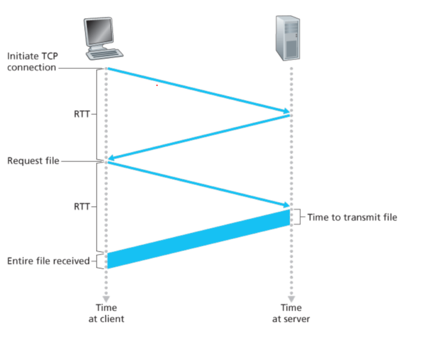


这种非连续连接会使得服务器负担很重，所以在HTTP/1.1中改进出了连续连接的方式，它可以让连接在返回响应后仍保持一定的时间，默认的连续连接模式是流水的，这就可以使得客户端连续发送报文请求，每次的间隔只有1个RTT，并且server端一直处于有事做的状态。

#### HTTP报文

HTTP报文的格式的一个例子：

```
GET /somedir/page.html HTTP/1.1
Host: www.someschool.edu
Connection: close
User-agent: Mozilla/5.0
Accept-language: fr
```

HTTP的第一行是request line,剩下的行叫作header lines,request line 包含三部分:method, URL, version。

method除了最常用的GET外还有POST，HEAD，PUT和DELETE

下面是一个通用的报文格式

 
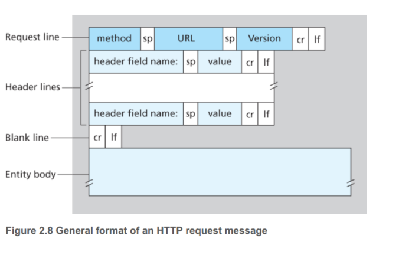


因为上个例子里面，method是GET，所以body是空的，而对于POST而言，POST一般使用在用户填写一些信息的时候，body就不是空的了。

>  a request generated with a form does not necessarily use the POST method. Instead, HTML forms often use the GET method and include the inputted data (in the form fields) in the requested URL. 实际上一般用POST的也比较少；使用GET方法中的数据位表示也可。

对于其他方法而言 PUT: 代表存储上传一个对象到URL中, HEAD和DELTE顾名思义。

对于server端回复的报文，十分类似

```
HTTP/1.1 200 OK
Connection: close
Date: Tue, 18 Aug 2015 15:44:04 GMT
Server: Apache/2.2.3 (CentOS)
Last-Modified: Tue, 18 Aug 2015 15:11:03 GMT
Content-Length: 6821
Content-Type: text/html
(data data data data data ...)
```

只不过是把request line变成了status line,下面是一些常见的状态码:

| status code |  meaning |
| ---- | --------------------|
| 200  | OK                  |
| 301  | moved Permanently   |
| 400  | bad request         |
| 404  | not found           |
| 505  | version not support |


在谢希仁的书中提到，`4xx`表示客户的差错，`5xx`则表示服务器的问题。

#### Cookies

下面讨论Cookies，虽然HTTP是一个不保留状态的协议，但是对于server端而言，有时候保留客户端的信息也是一件需求，通过Cookies网站就可以追踪用户的信息了

一般而言，Cookies由四部分构成 
- HTTP响应时候的header line(Set Cookie: xxx)
- HTTP请求时候的header line(Cookie: xxx)
- 用户系统的Cookies文件
- 网站保存Cokkies的数据库

 
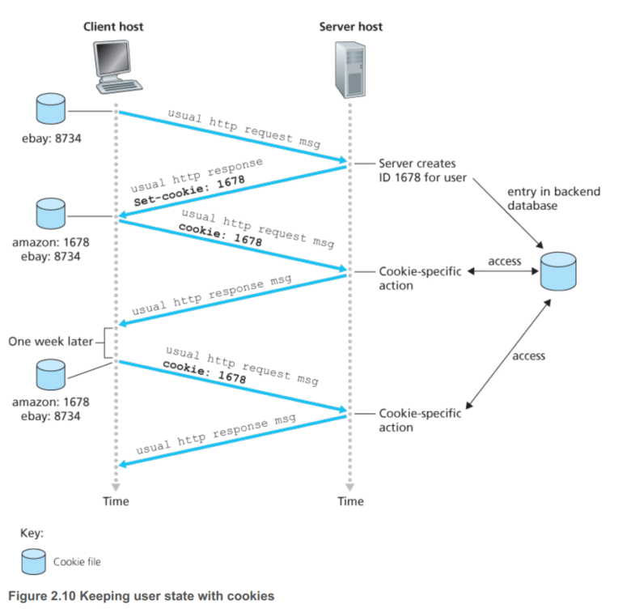


这样Amazon就可以知道给我推荐什么东西了，而且我买东西的时候只需傻瓜一件点击即可，登录的操作也免除了。

这也带来了关于隐私的讨论，我也很赞同隐私在这中间受到了一定的损害。

#### Web cache

Web cache或者说proxy server,代理服务器是拥有自己的硬盘空间来保存最近的请求对象数据，这样用户并不直接去访问server端，而是先看看web cache里面有没有，如果没有web cache就去访问server。

通常Web cache是ISP购买安装的，一般学校里面也会有，这样会大大降低网络的拥堵程度，减少请求的时间。

 
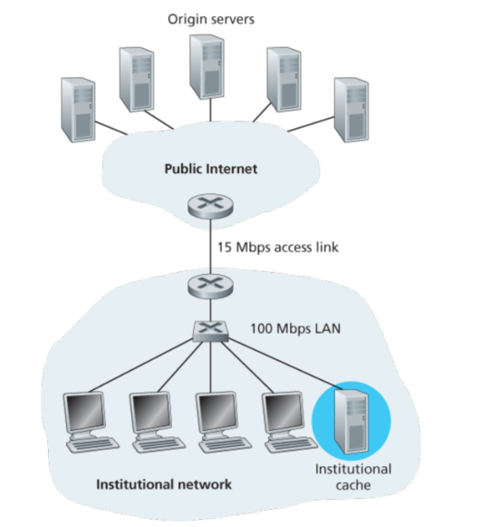


#### conditional GET

就像内存和cache的关系一样，有更新的问题，这里才用的方法是发送GET的同时，包含这样一个header line:`If-Modified-Since`(由web cache发送给最终的服务器端),如果修改了就更新即可。

### 2.3电子邮件

在不同的邮件server端通过SMTP协议传输，SMTP依托TCP

 
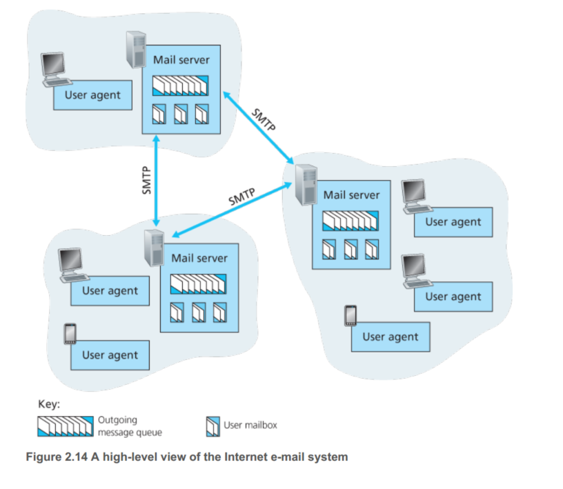


由上图，一个网络的邮件系统由三部分组成，用户代理(如Outlook)，邮件服务器，SMTP传输协议。

SMTP通信握手信号可读性很好。这是一个例子：

```
S: 220 hamburger.edu
C: HELO crepes.fr
S: 250 Hello crepes.fr, pleased to meet youC: MAIL FROM: <alice@crepes.fr>
C: MAIL FROM: <alice@crepes.fr>
S: 250 alice@crepes.fr ... Sender ok
C: RCPT TO: <bob@hamburger.edu>
S: 250 bob@hamburger.edu ... Recipient ok
C: DATA
S: 354 Enter mail, end with ”.” on a line by itself
C: Do you like ketchup?
C: How about pickles?
C: .
S: 250 Message accepted for delivery
C: QUIT
S: 221 hamburger.edu closing connection
```

Client端使用了五个命令,HELO,FROM,RCPT TO,DATA,QUIT，都不需要额外解释。

另外SMTP还是一个持续连接，这意味着A mail server发送给B mail server很多邮件时，可以在1个TCP中发送全部数据。

#### SMTP和HTTP对比


|        SMTP       |        HTTP        |
|-------------------|--------------------|
| 必须是7-bit ASCII |   无要求            |
| 方向是 push       | 方向是pull          |
| 多object一message | 一object一message   |

SMTP要求邮件主体必须是7-bit的ASCII码，

#### header格式

```
From: alice@crepes.fr
To: bob@hamburger.edu
Subject: XXX
```

 
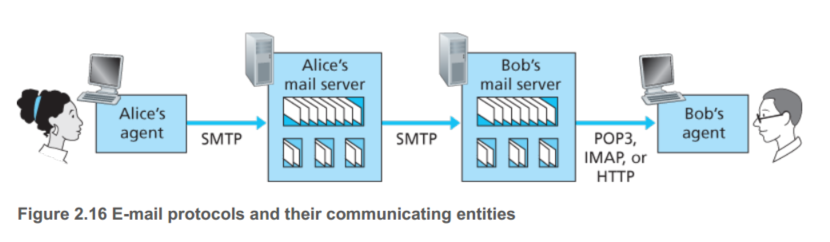


用户在PC上运行用户代理，理论上讲，邮件server可以在他的PC上，单这要求他的PC一直不关机，所以通常的办法如上图所示。需要注意的是，SMTP是一个push的协议，所以对于图中Bob的server端到Bob的用户代理，不能用SMTP。这部分通常用POP3，IMAP或者HTTP完成。

POP3是一个非常简单的协议，用户代理只有4个命令list,retr(获取),dele,quit。一个例子：

```
C: list
S: 1 498
S: 2 912S: .
S: .
C: retr 1
S: (blah blah ...
S: .................
S: ..........blah)
S: .
C: dele 1
C: retr 2
S: (blah blah ...
S: .................
S: ..........blah)
S: .
C: dele 2
C: quit
S: +OK POP3 server signing off
```

> . 用来结束文件

POP3协议的一个特点是，只要用户从POP3服务器读取了邮件，这个邮件就会被删除(download-and-delete mode)，这在某些情况下不太方便，因而POP3进行了一些扩充(download-and-keep)。

另一种协议是IMAP，比较复杂，他将每个邮件和文件夹联系了起来，这样就不会有读取完删除在另一台PC无法看的问题了。另一个特点是IMAP运行用户获取邮件的一部分信息，比如只获取header。


 


用户在PC上运行用户代理，理论上讲，邮件server可以在他的PC上，单这要求他的PC一直不关机，所以通常的办法如上图所示。需要注意的是，SMTP是一个push的协议，所以对于图中Bob的server端到Bob的用户代理，不能用SMTP。这部分通常用POP3，IMAP或者HTTP完成。

POP3是一个非常简单的协议，用户代理只有4个命令list,retr(获取),dele,quit。一个例子：

```
C: list
S: 1 498
S: 2 912S: .
S: .
C: retr 1
S: (blah blah ...
S: .................
S: ..........blah)
S: .
C: dele 1
C: retr 2
S: (blah blah ...
S: .................
S: ..........blah)
S: .
C: dele 2
C: quit
S: +OK POP3 server signing off
```

> . 用来结束文件

POP3协议的一个特点是，只要用户从POP3服务器读取了邮件，这个邮件就会被删除(download-and-delete mode)，这在某些情况下不太方便，因而POP3进行了一些扩充(download-and-keep)。

另一种协议是IMAP，比较复杂，他将每个邮件和文件夹联系了起来，这样就不会有读取完删除在另一台PC无法看的问题了。另一个特点是IMAP运行用户获取邮件的一部分信息，比如只获取header。


 
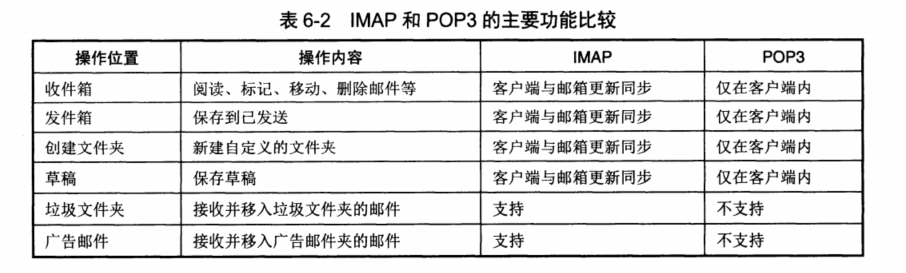


### 2.4 FTP

FTP:基于TCP，和HTTP部不同的是，FTP使用两个并行的TCP连接来传输文件，控制和数据。所以HTTP是 in-hand, FTP是out-of-band。另外FTP的data连接是不连续的，所以每次TCP只能传送一个文件；FTP server端必须维护用户的状态；FTP也是使用7bit的ASCII码，这让它容易阅读。

### 2.5 DNS

DNS最主要的作用是将hostname翻译成IP地址，DNS实际上是一个分布式的系统，它通过一组DNS服务器来组成的，DNS同时还是一个用户层的协议允许host查询分布式系统，DNS协议是允许在UDP上的使用端口53。

通常，DNS和其他应用层协议相互配合，举个例子：当一个浏览器(HTTP 客户端)运行在某个host上，请求一个URL(如www.bit.edu.cn)，那么我们首先需要获得这个URL对应的ip地址才可以。

1. 在用户的机器上运行DNS客户端程序
2. 浏览器提取hostname(www.bit.edu.cn)给DNS用户端使用
3. DNS用户端给服务器发送一个查询命令
4. DNS服务器最终返回给客户端对应的IP地址
5. 一旦浏览器从DNS接收到了IP地址，就可以和HTTP服务器建立连接了！(IP addr:80)

DNS同时还提供了其他几种功能:

- hostname重命名(alias)，方便人们记忆
- 邮件系统重命名
- 分布式加载，一个hostname可以有多个IP地址与之对应，比如CNN，这样当用户进行查询CNN的IP地址时，可以返回其中某个IP地址，这样就可以减少访问时的阻塞了

#### DNS系统组成

 
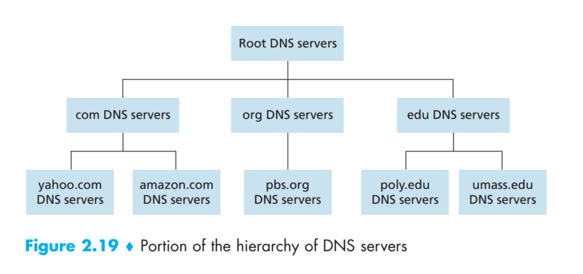


DNS是一个分布式的系统，因为如果所有的映射都保存在一个server，这会带来很多问题。所以形成了如图所示的结构。一共有三种DNS服务器，root, TLD(顶级域名服务器)和authoritative(权限/权威域名服务器)。

#### DNS查询


 
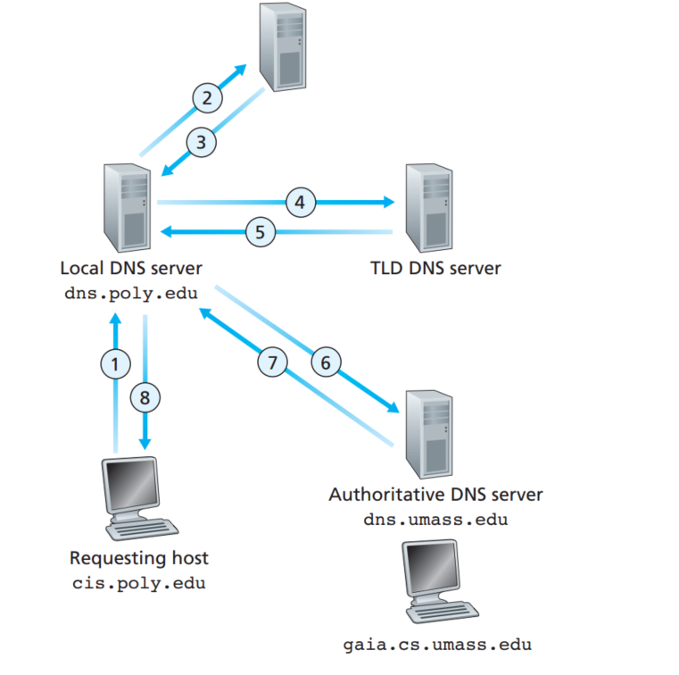


如图所示，还有另一种回溯的办法，不过在实际中，是用上图的迭代法，准确来说:host到local DNS服务器是回溯的，其他的都是迭代的。

#### DNS cache

一般来讲，一个server可以保存一些过往的信息，比如local DNS可以保存TLDserver的地址，这样就可以绕过访问root了。

DNS服务器存储的是resource records(RRs), 一个RR由思源组构成:

(Name, Value, Type, TTL)

TTL是RR的生命有效期，先可以忽略掉。

一些常见的record:
| Type  |  意思       |  例子                                  |
| ----- | ------------|----------------------------------------|
| A     |IP地址        |(relay1.bar.foo.com, 145.37.93.126, A) |
| NS    |权威服务器    |(foo.com, dns.foo.com, NS)              |
| CHAME |主机的规范名字|(foo.com, relay1.bar.foo.com, CNAME)   |
| MX    |电邮交互名字  |(foo.com, mail.bar.foo.com, MX)         |

#### DDoS

由于DNS比较脆弱，引申出了很多对于DNS攻击，一种方式是通过大量请求，已达到使那些真正的请求被搁置。不过这容易被DNS cache解决掉，另外通过packet filter也可以解决。另一种方式是欺骗方法，攻击者发送一个假的回复给DNS server，使得server接受假的RR存储在cache中，这样就可以把目的的web引导到欺骗者的web上了。

### P2P

目前为止介绍的这些应用如Web, email, DNS都是依赖于一个永远开启的服务器，不过P2P并不要求此，每一个peer都可以充当一个节点，可以与其他节点进行交互。

#### BitTorrent

peer从其他peer每次下载一个数据块，大小是256KB，每一个torrent都会有一个跟踪器，用来记录在这个大区域中其他的peer信息。

 
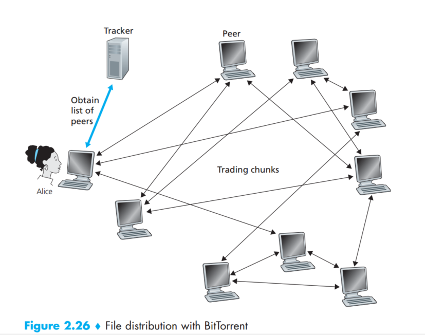


这样如图所示，当一个新的伙伴(Alice)加入这个块时，tracker随机的选择一些peer，并且把这些peer的IP地址信息给Alice。于是乎，Alice就会去和他们进行TCP的连接，不过随着时间柳树，一些邻居会离开，一些新的邻居会加入，所以与之相交互的peer不断改变。

那么，在给定的任意时刻，每个peer都会有一个文件(假设Alice就请求这个文件A)的一部分内容(块),那么Alice需要去周期地询问她的这些邻居谁有她想要的块。这带来两个重要的议题:

- 哪个块请求的优先级最高
- 需要给哪个邻居最先进行请求

对于第一个问题，Alice会使用一个叫做稀缺优先的准则，举个例子，比如Alice一共有三个邻居，邻居A有块1,2,3;邻居B有块1;邻居C有块1,2，所以这个时候会先请求3。

对于第二个问题，BitTorrent使用了一个比较聪明的算法，基本的准则是给那些可以与Alice连接有快速率的更高的连接优先级。

#### DHT 哈希散列表

下面考虑如何实现一个P2P网络中简单的数据库，这个数据库会存储简单的(key,value)对，下面考虑一个例子。这里key是内容名字，value是peer的IP地址。
假如Bob和Charlie都有Linux发行版，那么就会保存为(Linux,Bob的IP)和(Linux,Charlie的IP)。然后Dave这里使用DHT存储了<key,value>的信息，那么假设Alice想要获取Linux，首先她应该先获取这个DHT，这样她才知道要给谁请求，谁有Linux。所以实际上她会先去获取Dave里面的DHT的信息，然后访问Bob或者Charlie。

一种建立DHT的方法是Alice向所有的peer去询问谁有Linux，这听起来就很蠢。所以这里会有一种稍微优雅一点的方法，我们把N(4)个peer:Alice,Bob,Charlie,Dave可以映射成log2N个bit进行存储，(00,01,10,11) 这样一个自然的方法是每次都去寻找那个最近的节点，(当然他们在物理上可能很远)。
(懒得翻译了，感觉挺直白的)

> To gain some insight here, let’s take a look at a specific example. Suppose n = 4 so that all the peer and key identifiers are in
the range [0, 15]. Further suppose that there are eight peers in the system with identifiers 1, 3, 4, 5, 8, 10, 12, and 15. Finally, suppose we want to store the (key, value) pair(11, Johnny Wu) in one of the eight peers. But in which peer? Using our closest convention, since peer 12 is the closest successor for key 11, we therefore store the pair(11, Johnny Wu) in the peer 12.

假设有一个peer, Alice想要插入一个pair到DHT中，她首先确定哪个标识符离得最近，然后她会给那个标识符(实际上是peer)发送个信息，告诉他存储这个pair。但是Alice怎么知道哪个peer离这个key最近呢，如果Alice知道所有peer的ID和对应的IP地址的话，那她就可以一下子访问到了，不过这在实际的大型系统也是不可能的，一种折中的方法是存储Log2N的pair。

 
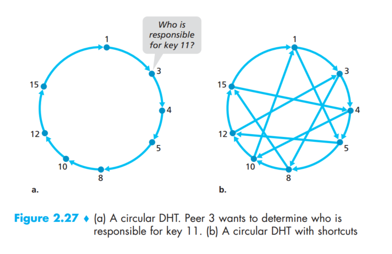

### 2.7 socket

socket正如前面提到的，是通信的接口，下面以UDP和TCP分别为例，用实际的python代码展示socket的工作原理。

#### UDP socket

当socket建立时，客户端需要把服务器的端口和地址打包发送，另外客户端自己的端口和地址实际上也会打包发送给对方服务端。虽然加入客户端的地址通常不需要UDP代码(这一般都是由操作系统维护的)。

```python

from socket import *

###  client ###
    serverName = 'hostname'
    serverPort = 12000
    clientSocket = socket(AF_INET, SOCK_DGRAM) #AF_INET 代表IPV4 SOCK_DGRAM 代表UDP
    message = raw_input('Input lowercase sentence:')
    clientSocket.sendto(message.encode(),(serverName, serverPort))
    modifiedMessage, serverAddress = clientSocket.recvfrom(2048)
    print(modifiedMessage.decode())
    clientSocket.close()

### server ###
    serverPort = 12000
    serverSocket = socket(AF_INET, SOCK_DGRAM)
    serverSocket.bind(('', serverPort))
    print("The server is ready to receive")
    while True:
        message, clientAddress = serverSocket.recvfrom(2048)  # 等待client传送
        modifiedMessage = message.decode().upper()
        serverSocket.sendto(modifiedMessage.encode(), clientAddress)
```

#### TCP socket

```python

from socket import *

### client ###

serverName = ’servername’
serverPort = 12000
clientSocket = socket(AF_INET, SOCK_STREAM)
clientSocket.connect((serverName, serverPort)) # TCP 首先和server建立连接
sentence = raw_input(’Input lowercase sentence:’)
clientSocket.send(sentence.encode())           # 然后直接只传送数据
modifiedSentence = clientSocket.recv(1024)
print(’From Server: ’, modifiedSentence.decode())
clientSocket.close()

### server ###
serverPort = 12000
serverSocket = socket(AF_INET, SOCK_STREAM)
serverSocket.bind((’’, serverPort))
serverSocket.listen(1)                                   # 参数是等待的最大连接数
print(’The server is ready to receive’)
while True:
    connectionSocket, addr = serverSocket.accept()       # 接收到client的地址完成TCP连接的建立
    sentence = connectionSocket.recv(1024).decode()
    capitalizedSentence = sentence.upper()
    connectionSocket.send(capitalizedSentence.encode())  # 同理，只需要将数据发送就可以，而不需要再发送地址了
    connectionSocket.close()
```
