## 第三章

### 3.1 运输层协议介绍

运输层协议协议提供应用进程之间的逻辑通信,所谓的逻辑通信是指从一个应用的角度来讲，host运行的进程仿佛是直接相连的那样，尽管物理层面上，他们可能相距很远。


<div align=center>  
 
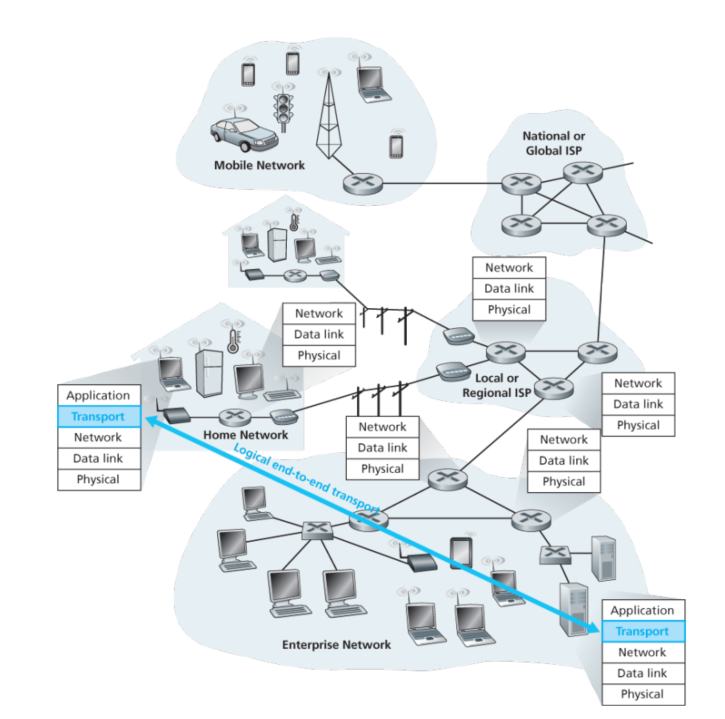

</div>

正如上图中所示的那样，我们需要注意的另一点是网关只作用于网络层部分的datagram，他们并不检测封装在运输层的那些datagram。

#### 运输层和网络层的关系

书里面举了一个形象的例子，我简化一下：假设小明一家10几个人住在中国，小张一家10几个人住在美国，他们是好朋友且用邮件通信。小明家的同学们把写好的信件交给小明家的看门大爷，由看门大爷收集分发。看门大爷只需要定器的把邮件给邮局送去，或者给邮递员送到邮局。同理小张家也是。

在这个例子中，邮递服务就是提供了一个逻辑链接，他是社区对社区的，而不是人对人。

对应的网络概念:

应用中的保文:   信件内容
进程:           写信的这些人
hosts:          小明一家,小张一家
运输层协议:     看门大爷
网络层协议:     邮递服务

运输层协议只负责把应用进程中的报文移动到万千网络中的一个小网络节点，在邮件中间传递的过程中，他们并不知道细节。就像看门老大爷不知道邮件是从太平洋到的美国，还是从大西洋到的美国。

实际上，开门大爷——运输层协议并不能保证什么，因为他会被网络层提供的服务所限制，如果网络层不提供贷款和时延保证的话，运输层的保障就无从谈起了。

不过，某些情况下，如TCP就可以在即使网络层协议不可靠的情况下也可以提供可靠传输。(?!目前还不清楚机理，神奇.jpg)

对于TCP和UDP来讲，他们最重要的责任是将IP的传送服务从system到system间提升到process到process间，我们把这种提升传输称为(de)multiplexing。

### 3.2 多路复用和解复用

对于计算机网络来说，多路复用和解复用是必须的。比如你有四个网络应用的进程正在运行，当你电脑中运输层接受到了来自网络层的数后，它需要将这些数据运送给这四个进程中的其中一个。

<div align=center>  
 
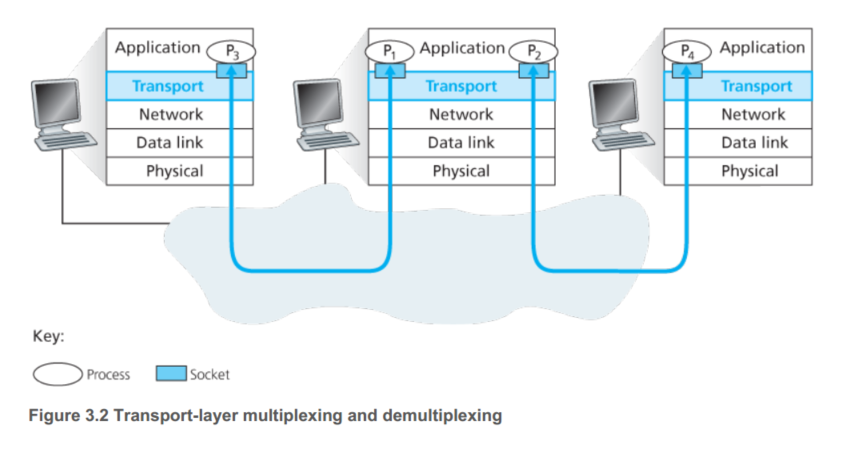

</div>

正如图中所示的那样，在接收端的运输层并不直接把数据传送给进程，取而代之地是一个中间的socket。每一个运输层的segment都拥有一系列的位用以实现复用和解复用。多路复用就是收集不同socket的数据块，把每个数据块和头部的信息(额外添加的)打包发送给下面的网络层。

多路复用需要(1)socket拥有唯一的识别符(2)每个段都有一些特殊的位用来告诉socket去向谁运输。这包括源端口号和目的地的端口号。0到1023的端口号是一些通用的，也就是说一般我们分配port的时候避开他们(RFC1700)。

需要注意的是，UDP socket是可以被一组(目标IP地址, 目标端口号)所完全识别的，结果就是如果两个UDP段拥有不同的源IP地址或者不同的源端口，但拥有相同的目标IP和端口的话，这两个段将会被直接运往到相同的目标进程(也是通过相同的目标系统的socket)

> 在这里，源处的端口号起到一个返回地址的作用

而对于TCP的socket来说，完全决定需要一个四元组(源IP地址，源端口，目标IP地址，目标端口);因而若两个TCP段拥有不同的源IP地址或源端口，他们将会被引导至两个不同的socket上。下图例子给出了很好的解释。


<div align=center>  
 
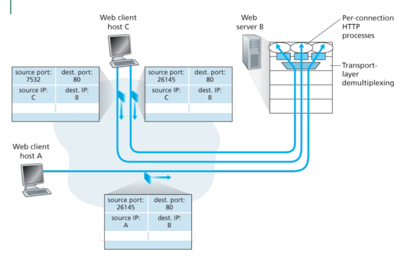

</div>

对于webserver来说，在socket和进程之间也不是一对一的，今日的高性能的Web服务器一般会为每个新的连接建立一个新的线程。对于那些不连续连接的HTTP来讲，依然会给服务器带来不小的负担。

### 3.3 拥有少连接的运输层协议:UDP

如果应用选择了UDP作为运输层的协议，那么应用几乎是直接地与IP对话。UDP在发送和接受运输层实体前并没有握手，因而UDP被称之为connectionless。

DNS就是一个典型的使用UDP的应用层协议，相对于TCP而言，UDP具有以下这些优点。

- 更好的控制什么数据传输，以及什么时间，对于UDP而言，当应用进程一把数据传输给UDP时，UDP就会把他们打包成UDP的段并且迅速的把这些段传递到网络层。TCP，拥有阻塞处理的机制。对于那些实时的应用而言，通常都要求一个最小的传输速率，并不想延时任何的传送，并且可以容忍一些数据的丢失，那么TCP就不是很适合这些应用了。

- 不需要建立连接。TCP需要使用三次握手在传输真正的数据之前。HTTP使用的是TCP，因为当你下载网络上的一些文件的时候，总希望他们是可靠的。不过QUIC协议(Quick UDP Internet Connection),在Chrome浏览器中使用的就是用的UDP作为运输层的协议，并且实现了应用层的可靠控制。

- 更小的头部，UDP需要8个字节: 2字节自己的端口，2字节目标的端口，2字节长度，2字节校验码;相比之下TCP需要用到20个字节。

实际上，即使使用UDP作为运输层的协议，在应用层的角度上保证传输可靠也是有可能的。比如说在应用层上加入确认和重新传输的机制。QUIC就是这么做的，不过那并不是一个trivial的工作:)

UDP使用1补码的方式，前两个2字节相加得到一个16bit的数据，再和第三个字节相加，取反就是校验码了，所以接受的时候把他们都相加就是1111...了。

UDP之所以提供这种校验码的目的在于不一定所有的链路之间都有检查的功能，甚至即使这个数据被正确的传送到了数据链路层，那么在router里面转移存储的过程中也是有可能出现错误的。虽然UDP提供了这样检错码的机制，不过他并不提供恢复错误的功能，一些UDP的实现直接简单地舍弃了那些损坏的段，另一些则把这些错误的段标记为警告。

### 3.4 可靠传输准则(重要)

这部分是精华啊，认真看书,决定翻译全文!

在这部分，我们将更广泛的层面考虑可靠传输的问题，这是因为实现可靠传输不仅出现在运输层，并且再链路层和应用层也会用到。这个问题是网络技术上一个非常重要的事情。

```

+------------------------------------------------------------------+
|                      APPLICATION LAYER                           |
|    Sending process                       Receiver process        |
|          ↓                                    ↑                  |
|          |                                    |                  |
+----------|------------------------------------|------------------+
|          |           TRANSPORT LAYER          |                  |
|           \       +-----------------+        /                   |
|            ------>| Reliable Channel|------->                    |
|                   +-----------------+                            |
+------------------------------------------------------------------+

```

上面说明了我们目前学习到的可靠传输的框架。这种抽象的服务提供给了更高layer的可靠保证。对于一个可靠的信道而言，没有任何一个bit会出现翻转的问题或者对视，并且可以按照顺序传递。这种服务也恰巧是TCP所能提供的。

实现这种服务并不是那么简单的，因为那些再可靠的传输协议下面的协议可能并非是可靠的。比如TCP是一个可靠的运输层协议，但是IP就并不是一个可靠的网络层的协议。

这这个小章节里面，我们将逐渐地开发发送和接收端的运输层协议，并且逐渐增加复杂度，举个例子来说，我们将考虑当信道会有误码或者丢失整个包的情况下，需要哪种机制。当我们讨论的过程中，我们假定包将会被按照顺序运输至目的地，尽管一些包可能丢掉了，也就是说包经过信道后并不会有错误的顺序。

```
+------------|----------------------------------|------------------+
|            |        TRANSPORT LAYER           ↑                  |
|  rdt_send()↓                    deliver_data()|                  |
|  +------------------+                +------------------+        |
|  | Reliable data    |                | Reliable data    |        |
|  | transfer protocol|                | transfer protocol|        |
|  | (sending side)   |                | (receiving side) |        |
|  +------------------+                +------------------+        |
|            ↑                         rdt_rcv()↑                 |
|  udt_send()↓                                  ↓                 |
+------------|-----------------------------------------------------+
|            |                                  |                 |
|            \       +-----------------+       /                  |
|            ------>| Reliable Channel|------->                    |
|                   +-----------------+                            |
|                                                                  |
+------------------------------------------------------------------+
```

如上面这个图所描述的那样,运输层的发送端将会被一个叫`rdt_send`的函数触发，这个函数将会把更高层的数据发送过来，(rdt 代表 reliable data transfer) ;在接收端，当一个包传送到目的地`rdt_rcv`会被调用,然后为了把数据继续传送给应用层，调用`deliver_data`。为了交换packet给更高或更低的层次，发送和接收端给另一端发送包是使用`udt_send`(unreliable data transfer)。

现在我们开始逐渐深入一些协议，他们将会逐渐变得复杂起来

#### 理想信道下的可靠传输 rdt1.0

我们首先考虑最简单的情况，在这种情况下，其下面的信道是完全可靠的。在此基础上的协议我们称之为rdt1.0，这是一个很普通简单的例子。他的有限状态机如下:

<div align=center>  
 
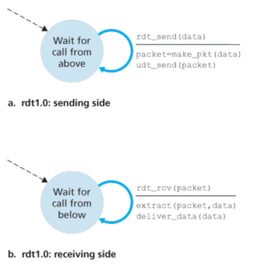

</div>

由于它比较简单，看图就可以了，发送和接收都只有一个状态(并且在这里我们假定了接收端可以迅速地接收发送端的信息)。

#### 信道有误码下的可靠传输 rdt2.0

一个更贴近真实情况的场景是packet中的某些bit可能会出现错误。这种错误在当今的网络下还是很容易出现的，比如在packet传递的过程，或者buffer的时候。在这种情况下，我们仍然将假定接收的包是按照顺序的。

在着手开展新的协议之前，我们首先考虑人们是如何应对这种情况的。在一个经典的场景下，接收消息的人会说"好的"来确保当前的话听懂了。如果他没有听懂，他会向你再询问，发出没听懂的意思比如"你说什么"。这种协议使用了积极认可("OK")和消极认可("Please repeat")。这种控制消息使得接收者可以让发送者直到当前的消息是否被正确接收了。也可以让发送者直到需要重新发送一遍。在计算机网络世界中，这种依赖于重传的机制称为ARQ(Automatic Repeat reQuest) protocols。

在ARQ下，我们需要实现以下功能: 错误检测，接收者反馈，重传，如下图所示，在左侧情况下，发送端等待高层数据传输，然后rdt2.0会把这个包加入校验码发给接收端，接收端会返回一个值，如果是NAK(代表有错误)就继续发送，如果没错误就返回最开始的状态，等待高层数据传输新的数据。接收端则是如果发现有错就返回NAK，继续等待；如果没错就把数据传给更高层的协议，并返回ACK信号。因为发送端必须等待接收信号确认才会发送下一个，这种协议也被称之为stop-and-wait协议。但这种协议对信道的利用率很低，并且如果ACK或者NAK有错误的话就会有问题。

<div align=center>  
 


</div>


解决ACK/NAK错误的一种方法是接入足够多的检测位,另一种是无论接收到一个错误的ACK还是NAK，都进行重新发送。这种方法的难点在于接收端不知道上个ACK或者NAK信号有没有被发送断正确接受，所以他事先并不知道将要到来的包是新数据还是重传的。

解决这种方法是使用sequence number。这样接收端只需要检查这个序列号就可以知道这个收到的包是否是重传的了。对于这种stop-and-wait协议来讲，一个序列号就足够。接收端会把最近接收到正确的sequence number发送回发送端，发送端只要比较序列号是否一致就可以了。

发送端的状态如下：1. 发送端高层layer的发送，整理数据添加checksum，并添加序列号为0，发送给接收端，接收端收到信号后如果有问题就会要求重传(如果seq number 有问题也是) 2.经过若干次重传或者直接ok，跳到下一个状态，这时发送端发送序列号为1的包，如果接收端发现序列号错误或者包错误，还是按照要求重传。

取代发送NAK，我们可以发送一个最近的正确包的ACK，这有相同的效果，如果发送者发现有两个相同的包被接受，就说明出现了问题，就像rdt2.2所示：


<div align=center>  
 
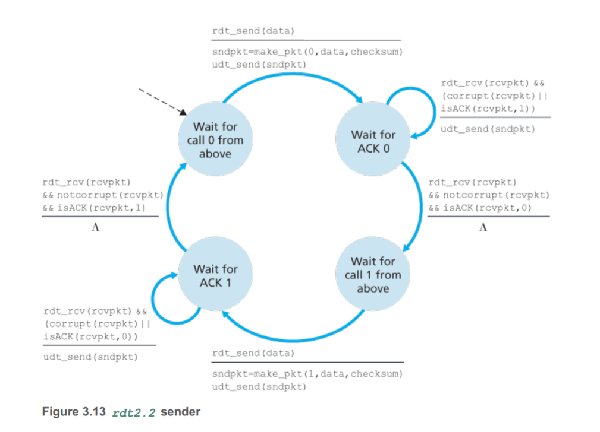

</div>

在rdt2.2中，并没有NAK信号了，取而代之的是如果当前发送的是序列0，我就返回一个序列1，这样发送端就知道发送的那个包出现了问题。

#### 在丢包情况下的可靠传输 rdt3.0

在当今的网络环境下，丢包其实是经常发生的，两个额外的考虑必须增加：1.如果检测包丢失 2.当包丢失时需要做什么 这里我们先把检测和恢复的任务放到发送端。假定发送者发送的那个包或者接受者对那个包的响应，丢掉了。在这种情况下，发送端将不会接收到来自接收端的回应。如果发送端等待的时间足够长了，那么发送端就确信，这个包丢失了，所以需要重传。但是究竟需要等待多长时间其实很难计算。

一个包实际上可能经过很大的延时，所以发送端可能会再次发送相同的请求即使这个包和ACK没有丢失。在这种情况下重复数据包会被发送到信道中，幸运的是在rdt2.2中我们已经有序列号实现了相关功能。

从发送者的角度来讲，重传是一个万能药，发送者并不知道数据包是否丢失，或者一个ACK丢失。实现一个基于时间的重传机制需要定时器来打断发送者。因而发送者需要1.在每个包(无论是第一次还是重传)发送的时候开启一个timer，2.响应时钟中断3.停止定时器

下面是一个rdt3.0的发送端的示意:

<div align=center>  
 


</div>

#### 流水线式的 rdt3.0

为了提高信道的利用率，我们不再使用stop-and-wait的模式，而是发送者会发送多个包而不等待响应。这对协议有了新的要求:

- 序列号必须增加，因为每个发送的包都需要有一个独特的序列号，所以0-1序列号不够了。
- 发送和接收端必须有能力buffer更多的包，至少发送者可以将那些已发送并且还没有ack的包buffer住。
- 选择合适的错误恢复方法:GBN或SR

<div align=center>  
 
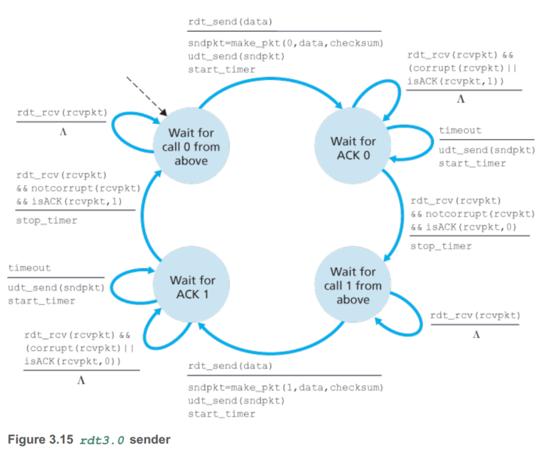

</div>

#### GBN(Go-Back-N)

在GBN模式下，发送者可以发送多个包而不必等待回应，但是并不能超过一个最大的数值N，N代表那些流水线中未被ACK的包

<div align=center>  
 


</div>

上图中展示了一个基本的GBN序列号示意图，base指向了发送但还没被接受的最远处的包。nextseqnum指向还未发送但是在窗口里面的下一个包。N又被称作窗口大小，GBN也被称为滑动窗口协议。对于为什么把那些已发送而未被ack的包也计算在内，这一方面是出于流控制，另一方面当我们学习TCP的阻塞机制时也会明白了。

在实际运用中，一个包的序列号是储存在包头部的一个固定长度里面，如果k是这个域的总bit数，那么序列号就是[0. 2k-1]了，对于有限的序列号而言，所有的关于序列号的操作必须进行2的k次方取模。TCP拥有一个32位宽的序列号域(TCP是以byte为单位，而非packet)。

下面是发送端的情况:

<div align=center>  
 
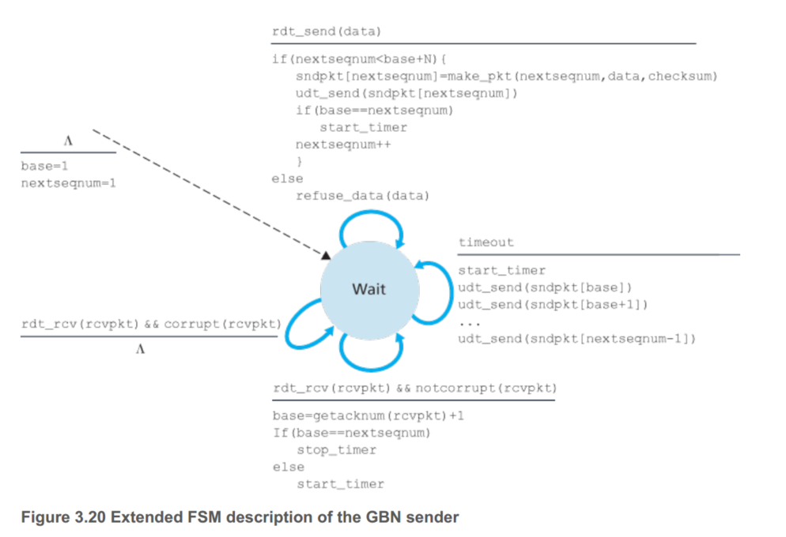

</div>

GBN必须可以被三种事件触发:

- 被更高层layer的调用, 发送端首先要检查窗口是不是已经满了，即使这里面有N个已发送未ACK的包。如果窗没有满，一个包就产生了并且被发送了，发送端的变量更新：如nextseqnumber++。如果窗口满了，发送端就会简单地把数据重新返回给更高的layer，这意味着告知高层当前窗已经满了。更高层将会在过一会去重新尝试。在一个实际的实现中，发送端可能会要么是缓存这部分数据，要么是有一些同步机制，使得高层的layer调用rdt_send当且仅当窗口不满。

- ACK 在我们的GBN协议中，一个对包n的确认将被视作累积的确认，意味着前n个包都是被接收端正确接受的。

- 超时重传 如果timeout发生了，那么发送者就会重新发送所有已发送的但是还没有被确认的包。

<div align=center>  
 


</div>

对于GBN来说接收端其实还是比较简单的。如果一个包(序列号是n)正确的接收了，并且是按照顺序(也就是传送给高层的上一个包的序列号是n-1),那么接收端就会发送给发送端响应一个ACK，并且把包的数据(除去header等)发送给高层。在其他的所有情况下，接收者直接丢弃这个包，并且发送ACK(只是这个ACK对应的序列号是最近接收并且是正确的那个)。

在我们的GBN协议中，接收端丢弃那些顺序不正确的包。尽管这看起来十分的愚蠢和浪费直接丢弃那些正确接受的包裹。对于接收者来说，他们只需要保留seqnumber的下一个顺序的包就好了。而发送端则需要buffer窗口N下所有的packet。

实际上GDB协议包含了几乎我们目前学到的所有的技巧，包括使用序列号，累计认知，校验，超时重传。

#### Selective Repeat

GBN可以让发送者充分利用流水线的功能，但是GBN本身也面临着性能的缺陷问题。实际上，当窗的大小和带宽延时都比较大的时候，许多包都有可能在流水线中。一个很简单的包错误就会导致GBN重传一大部分包，很多都是不必要的。

正如所命名的那样，Selective Repeat可以避免一些不必要的重传，仅仅对那些拥有错包或者丢失的重传。这就是的接收方需要记录窗口中每个包的状态。

<div align=center>  
 
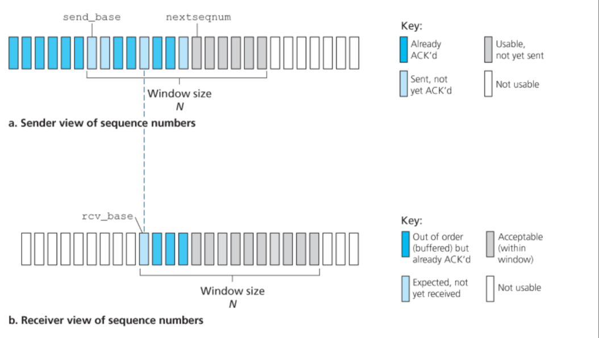

</div>

SR接收端将对那些正确接受的包(无论是否是顺序的)都会进行相应。那些顺序错误的将会被buffer直到任何丢失的包(packet拥有小的序列号)被接收。

SR发送端的事件和动作：

1. 从更高层的layer接收到数据，SR此时会检查下一个可用地序列号。如果这个序列号在发送者的窗口里面，这个数据就会被打包并且发送，否则告诉高层被缓存了或者请求过一会再传送。

2. 超时 定时器再一次地被使用，只是这次每个包都必须拥有各自的逻辑定时器。

3. 对ACK的响应。 如果ACK受到了，SR会标记那个包是已经收到了(假定他在window里).如果包的序列号等于base，那么window就会向前移动，直到一个未ACK的包。

接收端的事件和动作:

1. 如果是序列号为[rcv_base, rcv_base + N - 1]且正确接收的包。在这种情况下，接收端会返回给发送端一个ACK(带有特定的序列号)，如果这个包之前没有被接收过，那么它就会被缓冲。如果这个包的序列号等于接收窗口的base，那么这个包，和之前所有buffer的包都会被发送给上层。然后窗口向后滑动。

2. 接收到[rcv_base-N, rcv_base - 1]序列号的包且没有bit错误的话，也要返回一个相应的ACK。(因为收发两端的窗口可能不同步)

3. 其他情况下,忽略包。

下面是一个很生动的SR模式的流程

<div align=center>  
 
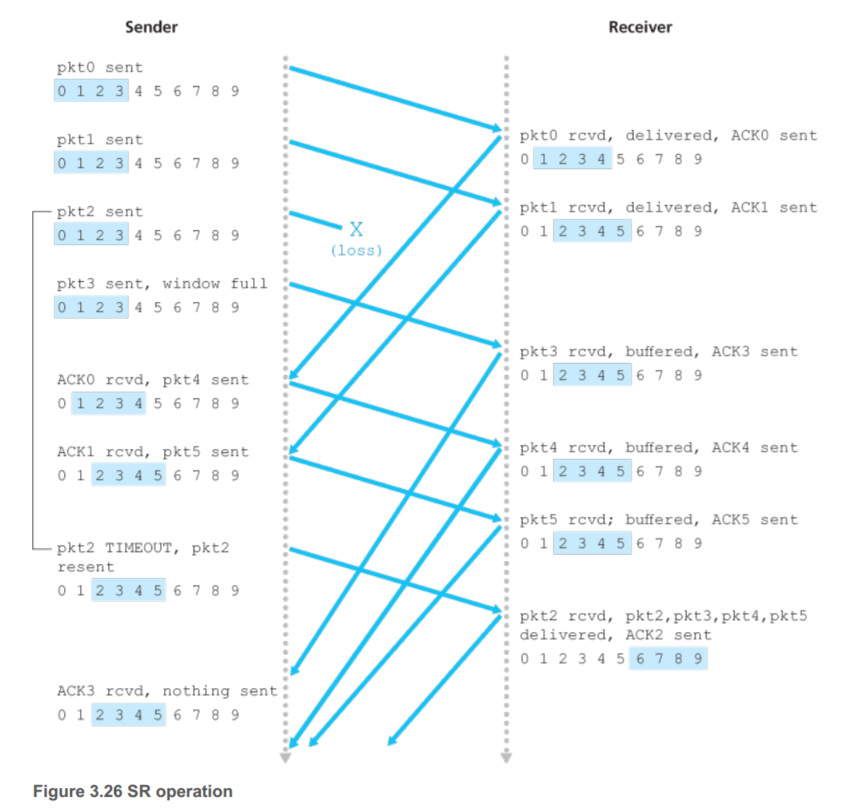

</div>

实际上缺乏同步机制会产生一些其他的后果比如当我们需要面对一个有限的序列号时。假定我们只有4个序列号，窗口容量是3。假定0-2的包裹都已经被正确的传送了。这个时候接收者的窗口时4-6，拥有序列号3,0,1。考虑第一种场景:ACK丢失了于是发送者重新传送这些包。因而接收者下次会收到包裹有序列号0，也就是第一个包的重传。此时接收端会收到**第1个包序号0的重传**。

第二种情况是前三个包的ACK均被正确地传送了。于是发送者的窗口也挪到了第4-6的包,序列号是3,0,1(注意此时发送接收都是3,0,1)，然后此时发送序列号为3,0的包(也就是第4第5个),不幸的是，序号3丢失的，所以在接收端直接收到了**第4个包序号0的发送**,可是对于接收端来说，他怎么知道这个包是不是重传的第1个呢?亦或是一个新的包。

> 事实上应该满足:windowSize <= 1/2 seqNumber

我们其实假定了这些包并不可能会出现乱序的情况。当然了，当发送端和接收端被一个物理线连接的时候，我们可以自然地给出这种假定。不过，当一个信道连接的是复杂网络，乱序包就会可能出现。一种问题是，可能一个序列号x出现在这个信道中，但是甚至并不在收发两端的任何一端的窗口中。一种方法是，只有当发送者**确定**先前的序列号x不在网络里面了的时候发锁着才会发送包x。这通常是以包不可能在网络中存活一定时间来实现的。对于TCP来说差不多是3分钟。(好像也挺久了的)

**这节很重要，要仔细再看看！**

### 3.5 TCP

TCP是一个基于connection的协议，因为应用进程在发送数据之前，两个进程必须首先和对方进行握手，TCP两端的变量都会进行一系列初始化的工作。TCP知识运行在两个终端系统上的，所以中间的router之类的实际上并不包含任何的TCP连接状态。

TCP连接提供全双工的服务，如果进程A和进程B之间有一个TCP的连接，那么A传B数据的同时，B也可以向A传输局。TCP连接也被称作点对点，因为他们是在单个发送者和接收者之间的。

三次握手的前两次并不携带任何数据，第三次可能会有数据包在其中。

<div align=center>  
 


</div>

对于接收端，实际上TCP会把数据发送到buffer中，对于发送端，TCP也会相应的把从用户端放入buffer的数据打包发送出去。不过对于TCP应何时发送buffer**并没有明确规定**。最大的数据包称作MSS，最大的传输单元容量是MTU，通常MTU是1500bytes，而MSS是1460bytes，另外40bytes是TCP/IP的头长度。

正如刚刚所讨论的那样，TCP拥有头部和数据两部分，当TCP需要传送一个比较大的文件时，比如网页的一个图像，通常它会被分散成多个大小为MSS的数据块，除了最后一个一般比MSS小一点。不过，一般来讲，传输的数据块是小于MSS的，比如对于Telnet而言，其中的TCP数据块一般只有1byte。

TCP结构示意:

<div align=center>  
 
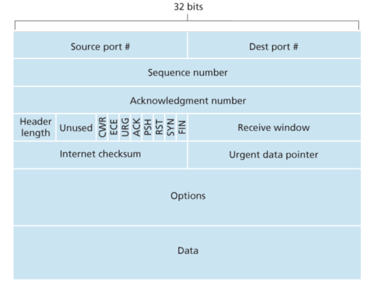

</div>

- **header length field** 一般是空的
- **options** 一般是当发送者和接收者商量MSS或者窗大小的时候用
- **flag** SYN,FIN,RST用来开始和结束TCP;ACK用来响应，PSH代表接收者应该立刻将数据传送给高层；URG代表这个数据是紧急的，不过一般PSH，URG都不用。

最重要的TCP头部信息就是序列号和确认号了。这些位是TCP可靠传输的基本。TCP把数据看作是按照一定顺序排列的byte。假设传输一个文件拥有500k bytes，MSS假定为1000 bytes，所以序列号如下图所示:

<div align=center>  
 
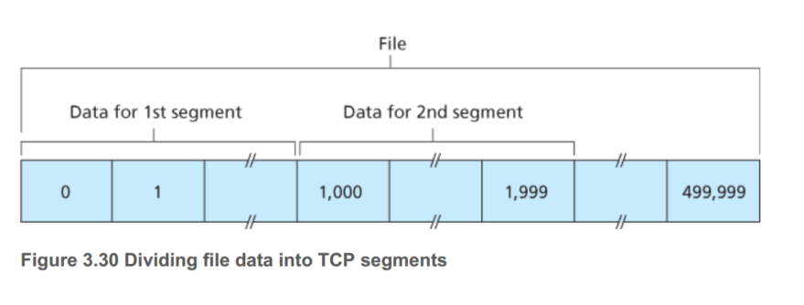

</div>

也就是说这个一个段的序列号对应的是其所包含的第一个字节的序号，对于第一个段序列号是0，第二个段序列号就是1000

ACK序列号实际上是所期望的下一个序列号，举个例子，假设A接受了从B发送的0-535byte，并且马上要给B发送一个segment。因而HostA在等待字节536，所以A把536放到ack里面然后把它送回B。

因为TCP仅仅会发送ACK对应的是数据流中下一个缺失的字节，因而TCP又被称作提供累计确认。

<div align=center>  
 
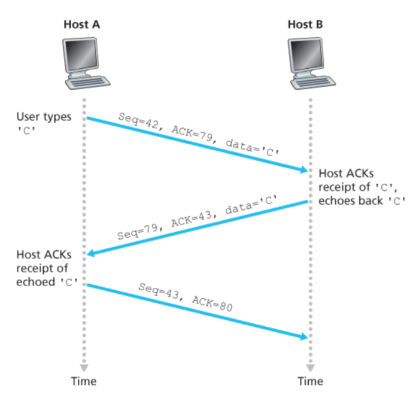

</div>

这是一个telnet在收发两端的示意图，虽然由于telnet不提供加密逐渐被ssh取代，但是他基于TCP仍然是一个很好的学习的例子。假设用户端和服务器端的序列号初始的分别是42和79，当TCP连接建立后，用户发送seq=42,ACK=79,data='C',服务器端正确接收后，返回seq=79,ACK=42,data='C'，然后用户返回seq=43,ACK=80确认这个消息收到了。

TCP就像我们之前讨论过的rdt协议一样，使用超时重传机制来恢复那些丢失的数据。虽然这个概念比较简单，但是确实有一些微妙的问题等待我们去解决，首先是如何确定超时的时间阈值，当然这个时间肯定是要大于RTT，如果小于RTT的话，不必要的重传也会发生。

首先我们给出一个概念SampleRTT，代表一个客户端段发送一个段到接受这个段的时间，大多数的TCP实现并不是对每个段都测量这个SampleRTT，而是只测量一个已发送但是没有ack的段，大概每次RTT会产生一个新的SampleRTT。并且，TCP并不会对那些重传的段计算SampleRTT。因为router中可能出现阻塞，所以SampleRTT在段与段之间来回波动。为了更好地估计RTT，需要对这些SampleRTT进行某种程度的平均。TCP这里维护了一个平均值，称作EstimatedRTT公式如下：`EstimatedRTT=(1−α)⋅EstimatedRTT+α⋅SampleRTT`α一般是1/8。对于那些较近的SampleRTT，比重更大。相对于SampleRTT而言，EstimatedRTT要平滑地多。

此外，测量RTT的变动程度也是有价值的，这个值称作DevRTT，表示SampleRTT和EstimatedRTT的误差有多大。公式如下: `DevRTT=(1−β)⋅DevRTT+β⋅|SampleRTT−EstimatedRTT|`β一般取作0.25，如果SampleRTT波动很小，那么DevRTT就会比较小，反之会比较大。

这带来了一个新的问题，我们有了EstimatedRTT和DevRTT，那么究竟重传的时间限是多少呢？这个时间应该比EstimatedRTT大，否则会有很多不必要的重传，但是也不能太大，否则TCP对那些丢失的包，响应的速度将会下降。所以听起来，这个时间应该是EstimatedRTT加上一些余量，这些余量就是DevRTT了。
最终的计算式如下：`TimeoutInterval=EstimatedRTT+4⋅DevRTT` 一般而言，TimeoutInterval被初始化为1。此外，当一个超时发生时，这个值将被double,这样可以避免过早的超时现象(即此时包已经正确接收了，但是ACK还在网络中没有传回来，暂时的double，可以解决此问题)。然后一旦段被接受了，EstimatedRTT更新了，那就仍然按照原来的方式进行计算TimeoutInterval。


