# 第四章 网络层:数据层次

## 4.1 网络层概述

首先需要注意的是，和运输层协议不同的是，网络层在每一个router内都是存在的。对于数据层次来说，每个router都需要将先前链路的数据发送至输出接口的链路上；而对于控制层次来说，最主要的工作是协助这些当地的每个router的传送数据，确认相应的线路。

### 4.1.1 forwarding 和 routing: 数据和控制层次

网络层的协议看起来蛮简单, 就是把包裹从发送端传递到接收端。

- Forwarding: 把包裹发送到合适的linker上
- Routing: 决定正确的路线使得包裹可以正常地从发送端传送到接收端

Forwarding 和 routing 这个概念一般混在一起，(个人理解也是这样), 不过Forwarding一般都只需要很短的时间，这一般都是由硬件实现的，而routing则会占据更长的时间，并且通常由软件来维护。

对于每个网络的router来讲，最重要的是forwarding表，根据达到的包的头部与这个表，router就知道要把数据分发到哪个下一级链路了。就像下面这个图:

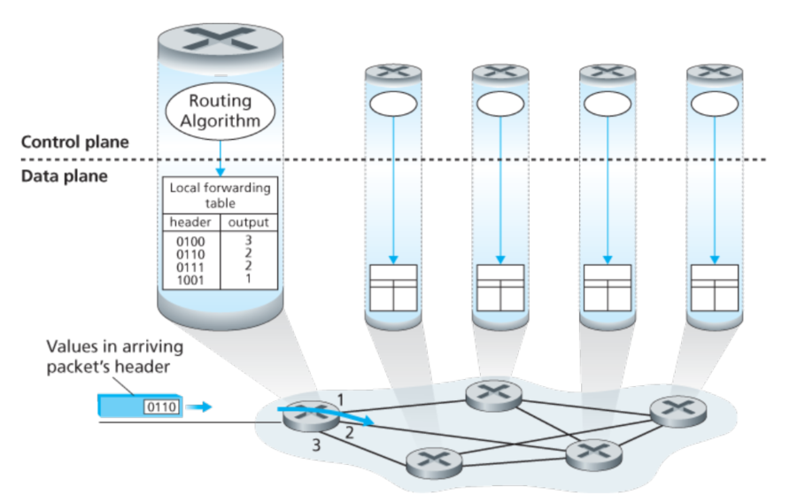

在上面这个例子中，routing的算法存在于每个router中，并且在router中有相应的forwarding和routing的功能。这个routing算法是可以通过和其他router里面的routing算法通信，并计算forwarding表。

> 如果所有的表都可以直接地被人工地确认更新，这样的话就不需要任何routing协议。

控制层次: SDN方法

实际上一种更为广泛的方法，是通过远程的控制器计算更新forwarding table，如下面所示：

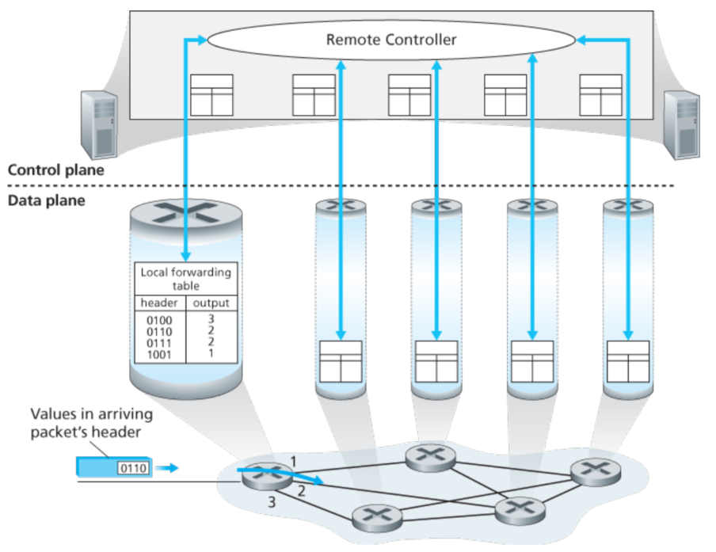

需要注意的是，尽管forwarding table更新的方式不同，但是他们二者的数据层次是一致的。

所谓SDN就是software-defined network，软件定义是因为控制器计算这个forwarding table并且这个控制器controller是由软件实现的。

### 4.1.2 网络层服务

一般来讲，网络层可以提供的服务如下:

- 可靠性
- 可靠性且延时不超过一定数值
- 顺序的传送
- 最小带宽以下保证正确传输
- 安全性(加密)

互联网提供的是非常简单的服务模型，通常被称为最大努力服务。在这种情况下，包裹的服务可以被认为是无服务的。

通常来说，router包裹根据目的IP地址来选择合适的link，更一般地是可以根据一些头部数值来选择合适的端口。包可能被阻止传递，或者重复发送，或者一些header值被重新改变。这些都是通过软件操作的，这也是SDN的核心所在。

一些交换包，被称作链路层交换(交换机?)，这是因为他们是根据链路层的数据来就行分组交换的(所以也被称作链路层(2层)设备)。其他的包裹交换，称作router，是根据网络层中的头部信息来进行转发决定的, 所以他们也被称为网络层(3层)设备。

## 4.2 Router里面有什么

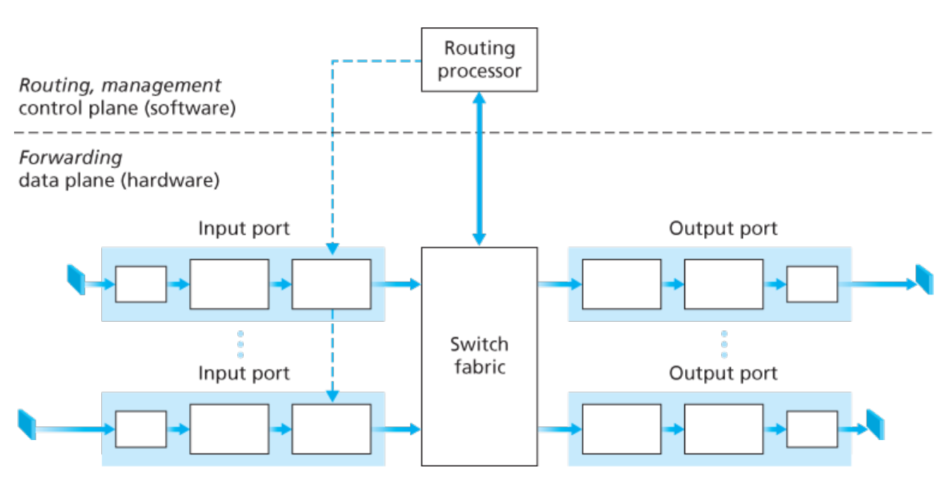

这是一个路由器结结构，主要组成有:
- 输入端口，将物理链路层接到路由器的**物理层**，这就是输入端口最左侧和输出端口最右侧的功能。输入端口扮演了**链路层**的功能，用来和链路进行交互，这是输入输出端口中间方框的功能。最重要的是查找的功能，这是输入端口最右侧的功能，通过查询转发表决定路由器的输出端口。包含有控制信息的包被转发给路由选择处理器进行下一步处理。

> 注意此时的端口是物理的输入输出接口，和软件中的端口号是完全不同的概念。实际上的端口数量可能有几百个并支持10Gps(甚至几十Tbps)的传输速度。

- 交换结构，连接路由的输入和输出端口
- 输出端口， 输出端看存储着从交互结构发来的包并把这些包传输到链路(输出端口需要实现一些必要的链路层和物理层的功能)。
- 路由选择处理器，这个处理器完成控制层面的功能。在传统的路由中，他执行一些路由选择的协议，并且维护一些路由查找表和链路状态信息，并且计算转发表。在SDN路由中，路由选择处理器是和远程控制器进行通信的，这是为了从远程的控制器接受最新的前向转发表。

一个路由的输入端口，输出端口和交互结构通常由硬件实现。这是为了速度的考量。

在我们深入探讨router之前，先看一个小例子，假设交互是一个环形路口，汽车进入环形路口时需要一些处理过程:

- 基于目的地的转发: 假设汽车停到了任何一个停车站，并告知了他的最终目的地，一个服务员在这个停车站查找这个终点地址并决定这个环形路口的出口，告知这个司机去哪个出口。

- 更一般地转发: 服务员可以根据其他的一些因素(除了目的地以外)决定这辆车去哪里。比如汽车的来源地，汽车拥有的licensen等。来自于某一块区域的或者具有某一类状态的可能会直接地使用某一个特定的出口。

在这个比喻中，入口道路和入口的车站就是输入端口，环形路口对应于交换结构，出口道路对应于输出端口。

### 4.2.1 输入端口过程和基于目的地的转发

一个更为仔细的输入流程如下图所示:

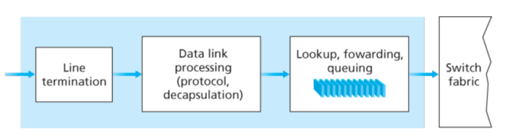

需要注意的是，前向转发表是从转发处理器复制过来的，这通常是通过一个分离的总线(如PCI)。通过这种浅拷贝，转发的决策可以被每个router各自产生,而并不需要和中心的处理器进行交互，这样避免了中心处理器的瓶颈问题。

一个简单的前向转发表是每个IP对应一个转发方式，但是由于需要记录太多的地址(4billion for 32bit)，所以这种方法并不可行，可以通过前缀的方法来进行判断。比如下面这个图:

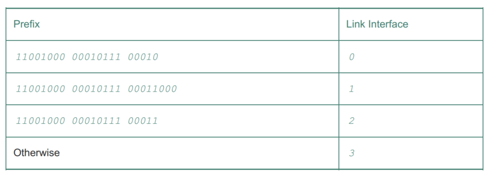

有时会出现一个值可以匹配多个prefix，这个时候需要匹配更长的前缀。比如
`11001000 00010111 00011000 10101010 ` 匹配的是link 1, 而不是2。

这样看来这个寻找的过程比较简单，但是当需要满足的传输速率很高的时候，就需要很小的延时才可以保证。所以lookup的过程必须由硬件来实现，而且简单的线性查找就不太满足时间要求了。对于内存访问时间我们也需要额外的关照，所以我们需要使用SRAM(作为DRAM的cache)。在实际工程中，TCAM(三元组)通常用于查找，在TCAM中，32位的IP存储在memory中，并以常数时间返回转发表中对应于那个地址的内容。

在一些设计中，一个包可以暂时地被交换结构阻止住，如果其他端口的包正在使用这个交换结构的话。这样一个blocked的包就会在输入端口进行排队等待，然后过一段时间会被调度到交换结构中。

lookup是一个很重要的动作，不过其他的一些也是很关键的: 1) 物理层和链路层的处理 2)包的版本号，检验和，存活时间 —— 这些都需要被检查，对于后两个，可能还需要重新修改。

在输入端口中，寻找目的地址进行匹配并让交互结构给指定的输出端口发送包是一个"match plus action"的动作。这个抽象动作在很多网络设备都存在，并不只是router中。在链路层切换中，也是有这种动作。

### 4.2.2 切换
- 通过内存切换，最简单早起的router都是传统意义上的乙酸计，输入和输出端口的交互都是通过CPU(控制处理器)的。输入输出端口就像是IO端口一样。在这种情况下，如果内存带宽是B个包/秒(读写都算上)。那么总的转发吞吐量小于B/2.另外需要注意的是，两个包不可能被同时向前转发，即使他们的目标输出端口不一样。因为只有一个内存写/读可以在系统总线上完成。 一些新近的处理器可能会使用一种类似于共享内存的技术，这样可以加快切换进度。

- 通过总线切换, 在有多个包请求的时候，除了一个包其他的都必须等待, 这样吞吐量会被限制在总线的速度上。尽管如此，这对一些小型区域的网络依然是足够了。

- 通过内部互联网络，这种会复杂一些。对于一个有N输入，N输出的端口来说，互联网络拥有2N的总线(好吧不是很懂)。这样的话可以支持并行地转发多个包。不过如果两个包从不同的输入端口传输到相同的输出端口，这样就必须等待。

### 4.2.4 发生queue的情况

包的排队情况在输入和输出端口都是可能发生的,当排队的现象更加严重的时候，就会出现丢包的现象了。

> 原文对排队做了好多解释，感觉没啥了解必要，跳过

### 4.2.5 包的调度

FIFO和优先队列(2个队列，一个优先级高)就不说了，下面说一下RR和WFQ，简单的RR算法和OS中的进程调度是一样的，一个广义上的RR队列是被称作WFQ(weighted fair queuing)如下图所示:

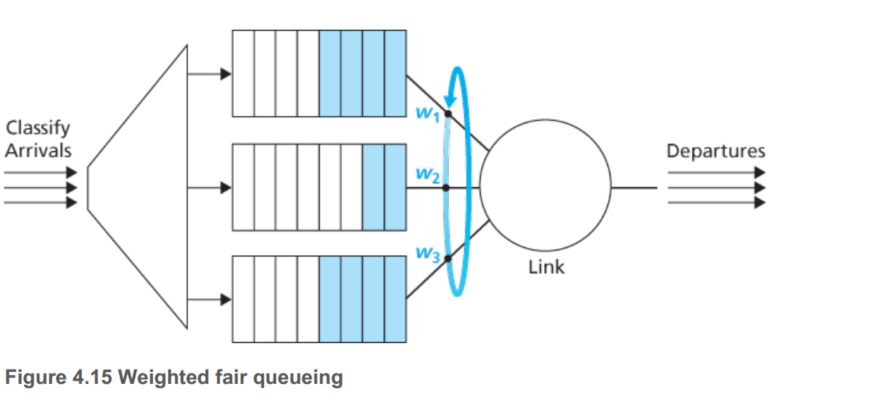

WFQ和RR不同的是，每一个不同级别的流了可以接受不同数量的服务。

> WFQ是一个基于Weight的公平队列，之所以说WFQ是公平的，是因为WFQ根据数据包的IP优先级来分配相应的带宽，**优先级高的数据包，分到的带宽就多**，优先级低的数据包，分到的带宽就少，并且所有的数据包在任何时刻都可以分到带宽，这就是它的公平之处。WFQ在根据IP优先级给数据包分配带宽时，是基于流（flow）来分配的。

## 4.3 IP协议

IP数据格式如下：

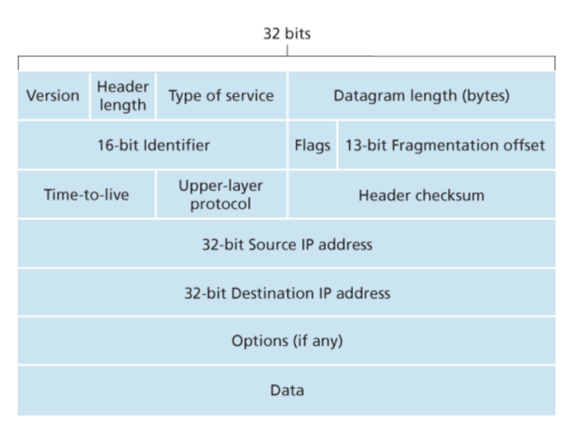 

- Type of service. TOS用来区别不同类别的IP包，比如一些可能对实时性比较高的，有一些不需要那么高的实时性。 这样router就会有不同的策略。

- 包长度. 这个位长度一共是16，所以最大的包是64KB，然而一般不会超过1500B

- 标志位，分片偏移量 这些位是为了IP fragmentation

- Time-to-live. 这个位用来确保数据段不会被永远的循环，这个field会在经过一个router之后就减1，如果变为0了那么router就不再转发它了。

- 协议. 这个field一般只用于IP包到达最终目的地。比如值6代表这个数据通过TCP传递的，而值17代表这个数据通过UDP传递。

- 校验 关于为什么TCP/IP都要校验这里有两个原因，其一：只有在IP层中，IP头部才会被校验，而TCP/UDP的检查是对应于TCP/UDP的段。其二是TCP/UDP和IP并不需要都属于某个协议栈，比如，TCP运行在别的网络层上，然后IP的数据并不通过TCP/UDP

IP有20字节的头部，而TCP也有20字节。所以对于一个datagram包含TCP段来说，一共有40字节的头部信息。

### 4.3.2 IPv4 分片

一般而言，一个链路层会有一个单次可接受最大的传输数据限制称为MTU，它要求IP的段不能超过一定的容量。这带来一个问题，不同的router之间可能使用不同的链路层协议，因为每个链路层协议的MTU可能不尽相同，所以当IP数据段超过某个router的最大容量的时候就会有问题。

解决的方法是将大的IP段分割成小的IP段，并把小的IP段重新防撞，然后发送，这些小的段就叫做fragment(分片)。

分片之后我们还需要重新收集起这些分开的片段，IPv4的设计这将重新收集的任务交给中断的系统而不是网络中的router。

当一个host接收到一系列的数据包时，它需要判断这些包是不是分片的，属于某个原来更大的包。如果这些包是分片的话，它还需要决定最后一次接收到片是什么时候。并且如何将这些片段拼起来。

为了完成这些任务，IPv4设置了标志位也就是刚刚图中的identification, flag 和 fragmentation offset位。当一个包发出时，发送端将识别号在这个包上盖了个戳。每次发送新的包，这个识别号就增加，当需要分片的时候，每一个小片都标记上原来的相同的识别号。这样接收方就知道哪些包是小片了。不过因为IP并不可靠，可能有的小片丢失了，为了确定接收方真的接收到了所有的包，最后一个片的flag为是0，而其他的片都是1。

另外为了让接收端知道传输过程中究竟哪个片丢了，offset位就会派上用场了。

### 4.3.3 IPv4 地址

每一个host端和router在公网中都必须有一个独立的IP值，在那些NAT中的不算。

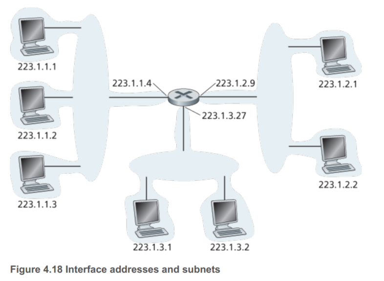 

左侧24bit都是相同的，在这张图中用交互机就可以连接。这个IP分配可以表示为223.1.1.0/24， /24又被称为子网掩码，告知最左侧24bit定义了这个子网络。

所以一般而言，一个公司拥有很多自网络，但他们都拥有相同的子网络地址。理论上不同的子网可以有不同的子网地址，在实际中，这些子网地址都很类似。

地址划分是由一个机构CIDR来完成了。一般的地址可以写作a.b.c.d/x，一般而言一个公司的IP拥有相同的前缀，只有这些前缀的位才会被公司以外的世界考虑。
所以对于router来讲只需要对特定的a.b.c.d/x存储一个entry就可以向公司中任何一个地址进行转发了。

剩余的`32 - x`用来分别公司内部的设备，所有的设备都有相同的前缀地址值，而根据这剩下的比特来区分私有网络中的设备。在CIDR之前，有一个经典版的地址分类，根据/8,/16,/24分成A、B、C三类IP网络。 不过CLASS C仅可以服务最多 `256 - 2 = 254` 个host，而B类最多65536个host又显得有些太大了。这就造成了资源的浪费。

另一种地址叫做IP广播地址255.255.255.255。当一个host给目的地址为255.255.255.255发送数据时，这个数据将会给所有子网络里面的host都发送。

**如何获取地址**

一个公司想得到一个IP地址，首先要和ISP对接，因为ISP拥有大量的IP地址。加入ISP拥有200.23.16.0/20，那么他可以分配比如8个地址:
200.23.16.0/23、200.23.18.0/23 ... 200.23.30.0/23，就像下面这个图所展示的那样。

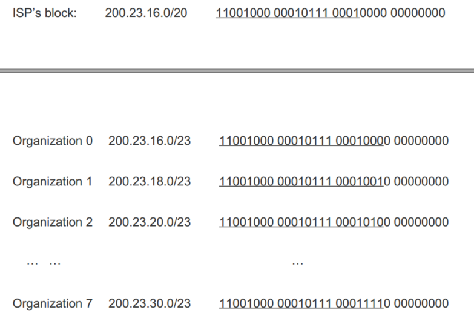 

**DHCP**

一旦公司得到了一组地址，那么就可以给host分配了，一般都是通过DHCP动态分配策略实现的。DHCP已经得到了很大的应用尤其是在无线网络，企业校园中。比如一个学生带着一台笔记本从宿舍走到了图书馆或者教室。那么在新的地点，将会连接到一个新的子网络并且有一个新的IP地址。

DHCP是一个客户和服务器交互的协议。对于一个新到来的客户，这个协议有四个步骤:

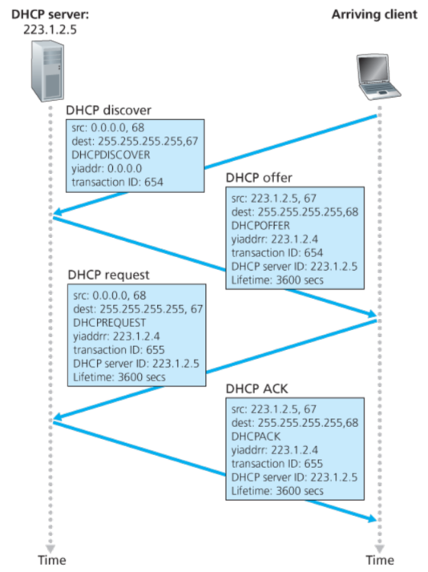 

1.寻找DHCP服务器，由于host不知道DHCP服务器地址是多少，所以需要向255.255.255.255发送，端口号是67,此时由于host还没被分配地址这里姑且是0.0.0.0。

2.服务器提供IP，这个时候同样的需要返回255.255.255.255因为服务器并不知道客户端的IP，都是0.0.0.0。在这个返回的信息里面就有动态分配的IP地址，传输的ID号(和输入对应)和失活时间等。

3.DHCP请求 客户端host在收到服务器发送回分配的IP地址后(我的理解是可能有多个服务器都提供了IP，所以此时只针对某一个还需要再请求)

4.DHCP ACK

对于便携性而言，DHCP拥有很大的短板。具体说来就是TCP连接不能是远程的。

### 4.3.4 NAT(network address translation)

NAT是负责一个子网络和外网交互，如下图，右侧是一个家庭网络，10.0.0/24，10.0.0.0是私有网络的三个部分中的一组。私有的地址表明这些地址仅仅对于那个网络中的设备才是有意义的。

实际上，每个家庭可能都会使用10.0.0/24，但是这些设备无法与公网通信，因为有成百上千的用户也是用相同的IP，所以这只对网络内部的设备有意义，而如果期望与外网通信，则需要NAT了。

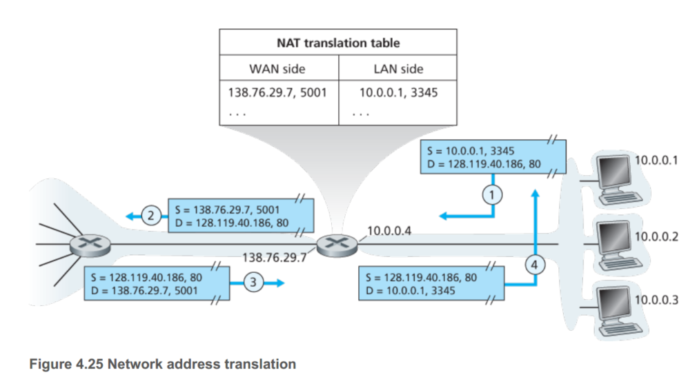 

NAT使能的router对外网来说就像是一个单一的设备拥有单一的IP地址。就像上图那样，对于公网来说router有一个地址138.76.29.7，但是公网并不知道router右侧的私有网络的信息。而外网的目的IP地址都是这个138.76.29.7,router需要将对应的包分发给对应的host，这就使用到NAT转换表了。

不过NAT也是优缺点的，端口号实际上应该对应的是进程，而不是host。因为使用NAT，一个host发送的port会被router重新定向到另一个新的port。

另一个问题是，router应该是网络层的设备，仅仅应该进行网络层包裹的运输，但是NAT破坏了合格规则，因为它相当于修改了源端口的IP地址。(好吧个人感觉也没什么大不了的)

### 4.3.5 IPv6

特点:

- 更长的地址范围: 128bits 有一个新的地址种类:anycast地址，允许数据包发送给一个组里面的任何一个host。
- 固定40字节的头部
- 流标记，区分实时性不同的包比如音视频和邮件。

具体格式如下：

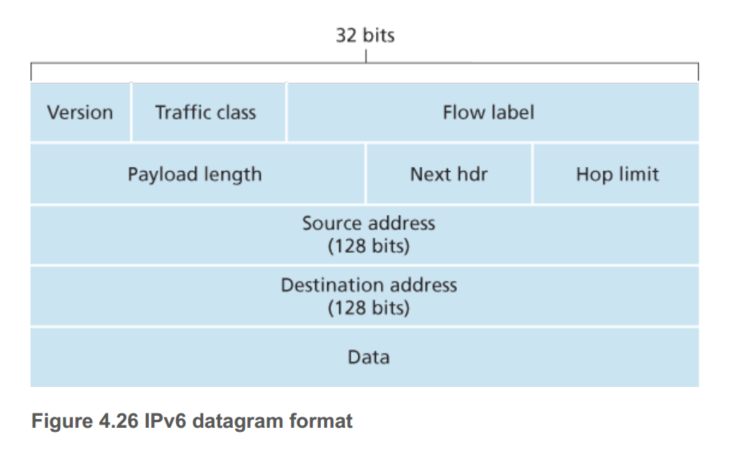 

- Traffic class: 如同IPv4中的TOS，用来给flow更高的优先级,或者给某些应用更高的优先级。
- next header: 告诉协议那部分要被传送(如TCP/UDP)和IPv4一样
- Hop limit: 每过一个router减1，到0就被丢弃

这些field被IPv4丢弃:分片、header校验、选择。

现在如果遇到过大的包直接丢弃，并且了为了速率的考虑取消了分片和校验的设置。header校验有些冗余。

**IPv4->IPv6**

通过管道的方式兼容，直接把IPv6的所有信息包括头部封装成IPv4的数据段:

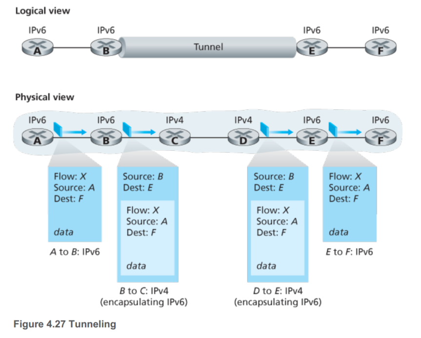 

> 网络层的协议短时间内很难再被改变了，应用层来说应该改变的更快一些