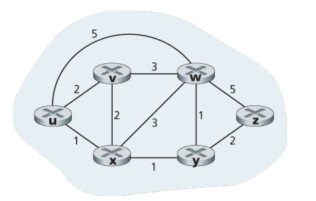
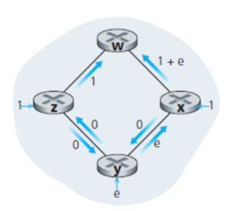
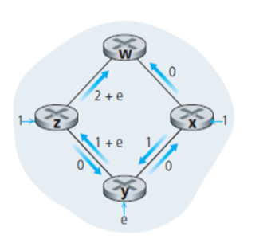
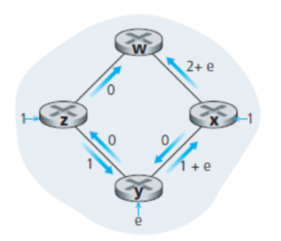
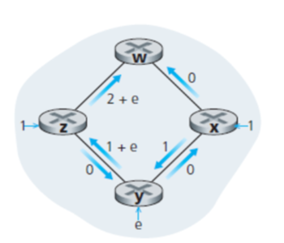
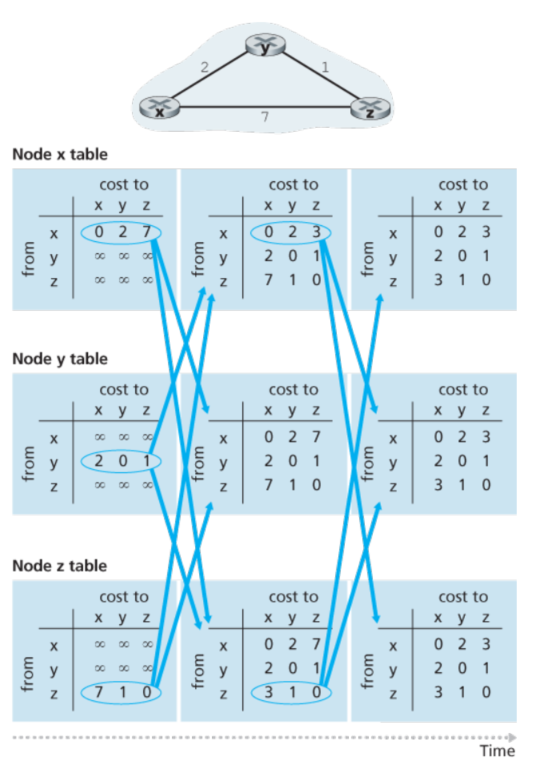
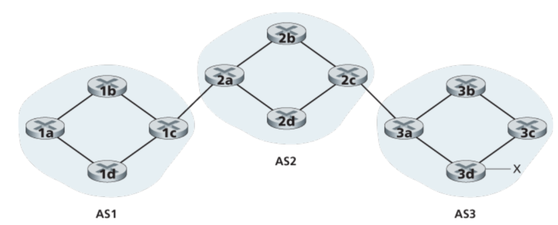
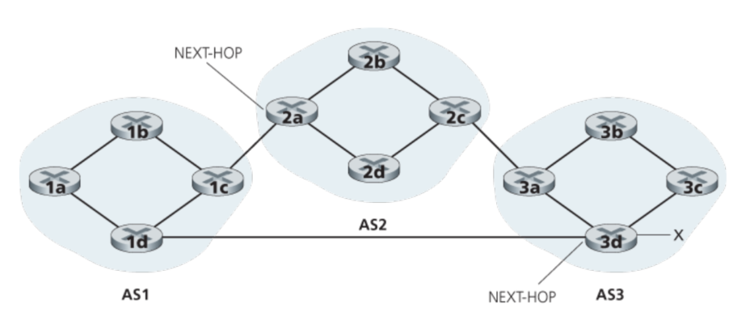
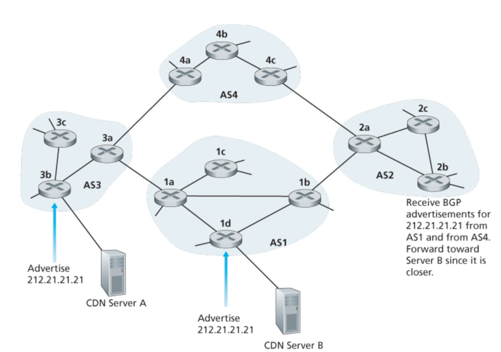
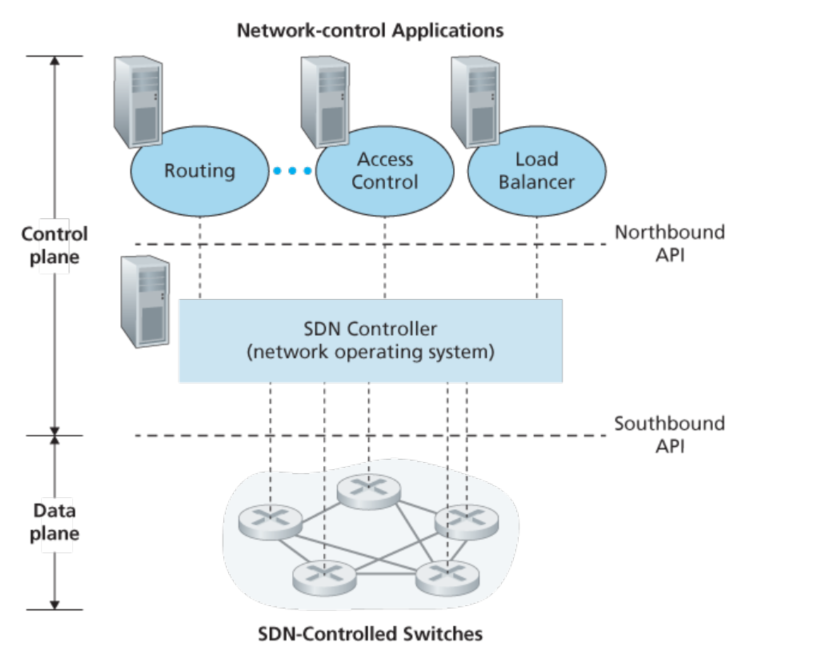

# 网络层：控制部分

## 5.1 简介

有两种可以控制转发表/流表，一种是每个router都有自身的控制器，另一种是通过远程的控制器。对于第一种来说，每一个router都有一个路由部分，可以用来和其他的router进行通信，从而确定转发表的数值。对于第二种来说，每个router里面有一个CA(control agent)，不过这个CA主要是用来和远程的控制器通信的，而且并不和其他的router中的CA通信。

## 5.2 路由算法



算法一：中心化算法——LS算法，需要获得所有节点和所有的边(权值)

算法二：去中心化算法——DV算法，没有一个节点拥有所有的路径信息。

第二种分类方法是根据算法是否是动态/静态，动态算法对路由成环/震荡更加敏感一些。第三种分类方法是根据是否负载敏感划分。

### 5.2.1 LS算法

LS算法需要拥有整个网络的节点和边，这通常是通过节点给所有网络中其他的节点发送信息完成的。实际中，这称作LS广播算法。LS使用的是Dijkstra算法
```
// 从u开始找
N' = {u}
for all nodes
    if v is neighbor of u:
        then D(v) = c(u, v);
        // c(x,y)表示从x到y的距离，如果不存在这样一条路径，则是∞。
    else
        D(v) = INF
Loop
    find w not in N' that D(w) is min
    N' += w
    update D(v) for w's neighbor
        D(v) = min(D(v), D(w) + c(w, v))
until N' = all node

```
**振荡**:

 



 


考虑y->w的路径，选择是顺时针方向，因为1 < 1 + e，此时y进过z到w，同理x也选择更小的路径：x->y->z->w。现在都是顺时针了，然后此时逆时针路径空了，就又都变为逆时针了，如此往复。

一个可行的解决方法是并不是所有的路由都同时运行LS算法。不过研究者发现最终router会自己同步，所以即便他们在不同的时刻(有相同的周期)运行这个算法，振荡问题并不能避免。一个解决的方法是(随机化通知的时间周期)大概是这样，就是(让周期不一样个人理解)。

### 5.2.2 DV算法

DV算法，每个节点仅维护有限的信息:当前节点和所有邻居的cost以及，从邻居发送过来的信息
```
// 
if y is neighbor of x: Dx(y) = c(x,y) 
else Dx(y) = INF
Boardcast neight
loop
    wait until one path available
    for each y in N:
        Dx(y) = min(c(x,v) + D(v,y), Dx(y))
    if change boardcast; 
```



对于DV算法来说，cost变小，在网络中会被很快地传播，但是cost变大的传播速度会非常慢。一种解决的方法是posioned reverse，如果z通过y到达x，那么z会告诉y，z到x的距离是无穷大

**LS和DV的比较**

空间：LS需要O(NE)的信息，而DV只需要neighbor的。
时间：LS是O(N^2)的, DV是不确定的因为可能存在循环的问题，也可能会有count-to-infinity的问题。
健壮: LS只会算自己节点的信息，而不会影响其他的，所以还可以；而DV则会扩散错误，因为每个周期节点都会向他的邻居广播新的cost。

## 5.3 OSPF

目前为止我们学到的模型是所有的router都是一样的，他们执行相同的路由算法，并且通过整个网络的信息计算路由路径。但实际上应用中这个同质的模型会被简化，这出于两部分考虑：

- 体量 对于LS来说，每个router都储存所有的可能的目标是需要非常大的内存的。对于DV算法而言，传播到整个网络是在是需要花费太久了。
- 行政自治: Internet是ISP的一个网络，由ISP的router构建ISP的网络。那么每个ISP都希望这个网络中运行ISP指定的服务，或者对外隐藏一个内部网络，理想情况下一个组织应该可以按照他的想法操作这个网络，并且依然可以和外界的网络交互。

这两个问题可以通过AS(autonomous system)自治系统来解决，每个AS中有一组router，他们运行的是相同的协议。

OSPF就是一个运行在AS中的协议，他是基于LS算法的，每个router通知其他所有在AS中的router，并且即使链路状态没有改变，每隔一段时间也会广播一遍。

OSPF还具有以下一些特征：

- 安全性 OSPF的路由可以被验证，只有信任的路由才会被加入到OSPF协议中，这通常可以使用简单的密码和MD5完成。
- 多个链路 当源到目的地址有多个路径拥有相同的代价时，OSPF允许多条路径被使用。
- 继承 在一个AS中，路由可以继续被划分成多个区域，每个区域都运行自己的算法，每个区域中也都会有若干个router负责把packet传递到别的区域。

## 5.4 在不同ISP间进行routing：BGP

OSPF是一个自治系统内部的协议，当一个包裹寻找路径的源和目的都在相同的AS中，这个路径将完全由内部AS协议决定。不过在AS之间则要采用另一种协议：BGP(Border Gateway Protocol)。BGP是一个十分重要的协议，因为它基本上可以说将成千上万个ISP连接了起来。

在BGP中，包裹并不是直接运送给特定的目的地址，而是一个前缀(?)，比如在BGP中，一个目的地址可能具有138.16.68/22的形式，这说明他可能包括1024个IP地址。所以一个路由的转发表将会有这样一个入口:(x,l)，x是一个前缀(138.16.68/22)而l是一个接口号。

BGP提供每一个router一个方法来：

1. 从邻居自治系统中获取prefix可到达的信息
2. 决定最好的路径

### 5.4.2 广播BGP路径的信息

对于每一个AS来讲，每个router都要么是一个网关router，要么是一个内部的router。网关router就是来连接其他AS中的router。下图中的1c和2a之间，2c和3a之间就是eBGP。



为了传播可以到达与否的信息，iBGP和eBGP的信息都将会被使用。举个例：传播一个可以到达路径的前缀x给AS1和AS2所有的路由。这种情况下，3a首先发送eBGP信息"AS3 x"给2c，然后2c给所有其他AS2中的router发送iBGP信息"AS3 x"，然后2a给1c发送EBGP信息"AS2 AS3 x"。最后1c使用iBGP发送"AS2 AS3 x"给所有AS1中的router发送信息。

在实际情况下，可能会有多种路径的存在，如下图所示：



### 5.4.3 选择最佳的路线

BGP里面有两个重要的属性：AS-PATH, NEXT-HOP。AS-PATH属性包含了一组AS，表征是如何传播的，就像刚刚所展示的那样。而NEXT-HOP是AS-PATH起始位置路由的IP地址。从AS1到x有两个路径，对于"AS2 AS3 x"而言，NEXT-HOP就是router 2a的IP地址。

**Hot Potato寻路**

热土豆算法会选择距离NEXT-HOP路由代价最小的路线。因而它是一个自私的算法，这个算法考虑的仅仅是希望在当前AS里面的代价最小。

**Route-Selection Algorithm**

在实际应用中，BGP应用的算法将会是如下这样，直到只剩下一条路径:

1. 一个路线被赋予一个local优先级的值，就像AS-PATH和NEXT-HOP一样。这个local prefernece 可以被其他router设置，或者通过AS从其他的router获知。这个值如何确定则是完全取决于网络管理者如何决定的。那么具有最高local preference的值将会被选择。

2. 当出现多个local preference时，那个拥有最短AS-PATH的将被选择, 一般而言BGP会使用DV算法，

3. 如果仍然拥有相同的AS-PATH长度，则使用hot potato算法，如果仍然有剩余，则使用BGP表示符选择

### 5.4.4 IP-Anycast

除了用于AS间的路由协议，BGP还通常用于实现IP-anycast服务，这在DNS中十分常见。考虑以下场景(1)相同的内容在不同地理位置的服务器上(2)让每个用户可以访问到最近的服务器。



如上图所示，在IP Anycast阶段，CDN可以给服务器分配相同的IP地址，并使用标准的BGP协议从其他server获取IP地址。当BGP路由器收到多个相同IP的路径建议时，router会把它当做不同的路径。然后router使用BGP算法挑选最好的那个。

### 5.4.6 小结

获取网络服务的步骤:1.连接到当地地ISP，localISP会分配给一些地址如 a/24地址，包括256个地址，讲这些地址分配给Web服务器，邮件服务器等等..
2. 其次需要获取公司域名，并且需要在DNS里面有解析。并且提供自己DNS服务器的IP地址，最终会把DNS服务器(域名及IP地址)放到.com顶级服务器中。这步之后，任何用户知道你的域名就可以从DNS中获取ip地址了。

当一个不属于你的AS的人请求你的IP的一个包，router实际上一开始并不知道公司的prefix，这就要通过BGP来完成。

### 5.5 SDN 控制层

SDN架构有4个特性：

- 基于流的转发： 通过SDN控制的网关可以依据任何传输层，网络层，链路层的头部进行转发。而传统的方法，router只依据目的IP地址就行转发。转发的规则是由流控制表确定的，而这就是SDN控制层的任务：在所有网络的设备中确定，管理流控制部的entry。

- 分离数据部分和控制部分：数据部分由网络设备组成，相对而言比较简单但是很快速，并根据流控制表中的规则执行"match plus action"。而控制层则由服务器和软件来确定管理网关的表项。

- 网络控制功能位于数据层交换机的外部：如下图中所示，控制部分包含SDN控制器(网络操作系统)和一系列的网络控制的应用。controller维护网络状态的信息，提供给网络控制的应用程序，并且提供一些方法使得网络控制层的应用程序可以监测，运行，控制底层的网络设备。尽管图中的控制器是一个集中的服务器，实际上，一般都是通过多个服务器联合组合而成。

- 可编程的网络 通过网络控制的应用，网络是可以编程的。这些应用代表了SDN控制层的大脑。使用SDN控制器提供的API，应用就可以控制网络网络设备中的数据了。



### 5.5.2 SDN控制层：SDN控制器和SDN网络控制的应用
