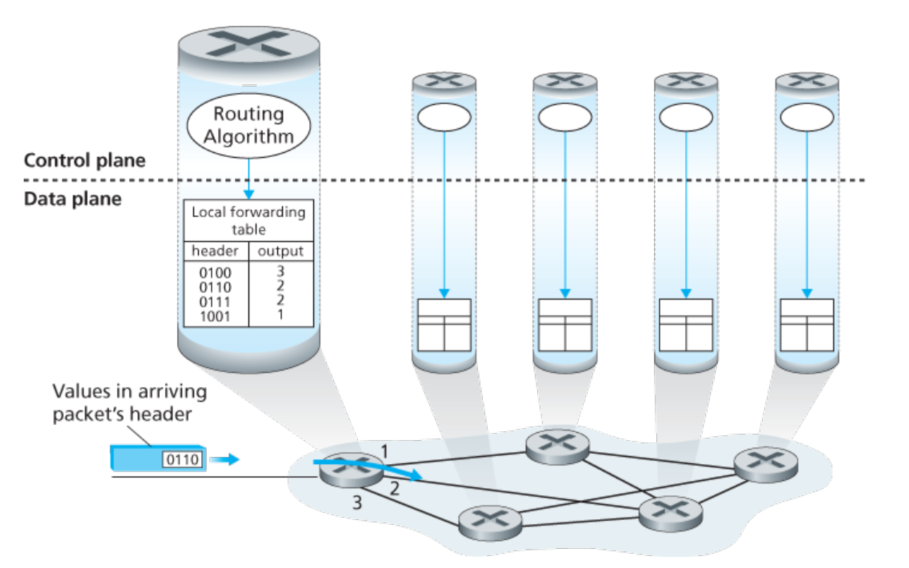

# 第四章 网络层:数据层次

## 4.1 网络层概述

首先需要注意的是，和运输层协议不同的是，网络层在每一个router内都是存在的。对于数据层次来说，每个router都需要将先前链路的数据发送至输出接口的链路上；而对于控制层次来说，最主要的工作是协助这些当地的每个router的传送数据，确认相应的线路。

### 4.1.1 forwarding 和 routing: 数据和控制层次

网络层的协议看起来蛮简单, 就是把包裹从发送端传递到接收端。

- Forwarding: 把包裹发送到合适的linker上
- Routing: 决定正确的路线使得包裹可以正常地从发送端传送到接收端

Forwarding 和 routing 这个概念一般混在一起，(个人理解也是这样), 不过Forwarding一般都只需要很短的时间，这一般都是由硬件实现的，而routing则会占据更长的时间，并且通常由软件来维护。

对于每个网络的router来讲，最重要的是forwarding表，根据达到的包的头部与这个表，router就知道要把数据分发到哪个下一级链路了。就像下面这个图:

在上面这个例子中，routing的算法存在于每个router中，并且在router中有相应的forwarding和routing的功能。这个routing算法是可以通过和其他router里面的routing算法通信，并计算forwarding表。

> 如果所有的表都可以直接地被人工地确认更新，这样的话就不需要任何routing协议。

控制层次: SDN方法

实际上一种更为广泛的方法，是通过远程的控制器计算更新forwarding table，如下面所示：

需要注意的是，尽管forwarding table更新的方式不同，但是他们二者的数据层次是一致的。

所谓SDN就是software-defined network，软件定义是因为控制器计算这个forwarding table并且这个控制器controller是由软件实现的。

### 4.1.2 网络层服务

一般来讲，网络层可以提供的服务如下:

- 可靠性
- 可靠性且延时不超过一定数值
- 顺序的传送
- 最小带宽以下保证正确传输
- 安全性(加密)

互联网提供的是非常简单的服务模型，通常被称为最大努力服务。在这种情况下，包裹的服务可以被认为是无服务的。

通常来说，router包裹根据目的IP地址来选择合适的link，更一般地是可以根据一些头部数值来选择合适的端口。包可能被阻止传递，或者重复发送，或者一些header值被重新改变。这些都是通过软件操作的，这也是SDN的核心所在。

一些交换包，被称作链路层交换(交换机?)，这是因为他们是根据链路层的数据来就行分组交换的(所以也被称作链路层(2层)设备)。其他的包裹交换，称作router，是根据网络层中的头部信息来进行转发决定的, 所以他们也被称为网络层(3层)设备。